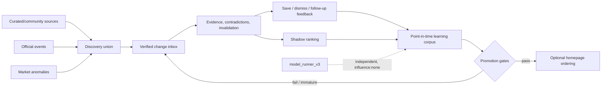
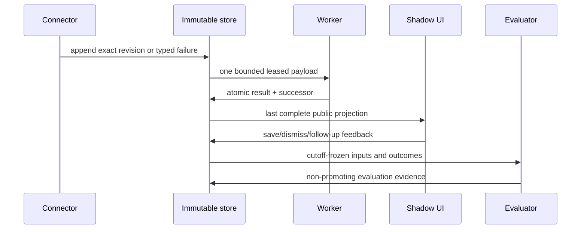
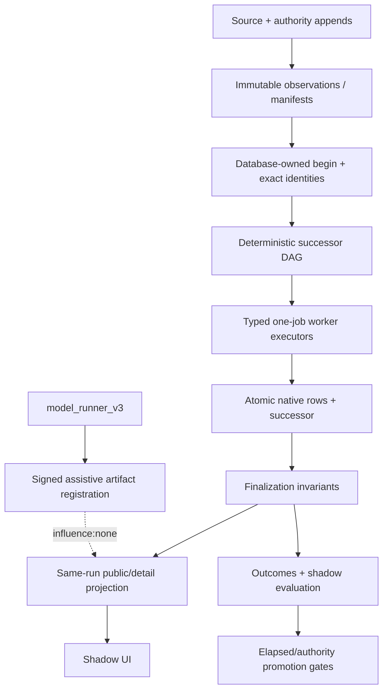
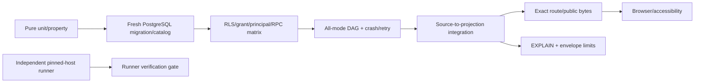

<!-- /autoplan restore point: /Users/kaerchen/.gstack/projects/Kaichen9527-stockinsider/codex-source-led-opportunity-engine-v3-autoplan-restore-20260724-191533.md -->
# Tasks: source-led-opportunity-engine-v3

## V3.19 single release closure — only active action queue

- [x] Preserve V3.16.21 as a predecessor: old formal-action authority remains
  disabled; V3.16.20 forensic activation remains rolled back and is never restarted.
- [x] Mark every historical password/credential rotation item `superseded/do_not_execute`.
  The database password must not be reset.
- [x] Freeze the one bounded V3.19 successor tree on `3bacd58c86f01c469b7d634e0f6df036ae7152a2`:
  bounded installer handoff, source-led readiness lanes, same-revision dossier,
  reviewed runtime disk policy, V3.19 schema/health compatibility and semantic CTA contrast.
- [ ] Run exactly one fresh Requirements review and one independent Architecture
  review for that immutable V3.19 tree; repair a common root once rather than
  creating numbered review loops.
- [ ] Create the exact implementation commit, complete exact diff/repair/full-range
  review with P0=0/P1=0, and pass the protected Code Gate.
- [ ] Rehearse the reviewed additive migration chain, activate the matching runtime
  and complete two terminal producer invocations. Do not reset any password and do
  not enable LINE, dispatch, auto-trading or Promotion.
- [ ] Deploy the exact reviewed release to both existing Vercel projects; complete read-only
  smoke, performance, nonzero-card, revision-consistency and Safari checks.
- [ ] Publish the release-state evidence carrier and close the single release checkpoint as
  `closed`; only third-party terminal failures and real-cohort evaluation governance may remain concerns.

All older unchecked production, migration, gate, activation and credential items
below are a historical ledger and are `superseded/do_not_execute` unless referenced
by `current-release.json`. They are not the current action queue.

## Architecture checkpoint — Sol only

- [x] Capture repository and production baseline without mutation.
- [x] Classify predecessor impact and invalidate structural-only acceptance claims.
- [x] Amend discovery boundary to source-led bounded funnel.
- [x] Define requirements, design, source matrix and canonical acceptance inventory.
- [x] Record fresh Requirements Gate Round 1 `CHANGES_REQUIRED` and repair all nine P1 findings.
- [x] Record fresh Requirements Gate Round 2 `CHANGES_REQUIRED` with eleven P1 findings.
- [x] Repair all Round 2 blockers and expand the canonical inventory to 107 cases.
- [x] Record fresh Requirements Gate Round 3 `CHANGES_REQUIRED` with eight P1 findings.
- [x] Repair all Round 3 blockers and expand canonical financial/manifest coverage to 113 cases.
- [x] Record fresh Requirements Gate Round 4 `CHANGES_REQUIRED` with ten P1 and two P2 findings.
- [x] Repair all Round 4 blockers and expand canonical acceptance coverage to 123 cases.
- [x] Record fresh Requirements Gate Round 5 `CHANGES_REQUIRED` with ten P1 and three P2 findings.
- [x] Repair all Round 5 blockers and expand canonical acceptance coverage to 129 cases.
- [x] Record fresh Requirements Gate Round 6 `CHANGES_REQUIRED` with ten P1 and four P2 findings.
- [x] Repair all Round 6 findings and expand canonical acceptance coverage to 143 cases.
- [x] Record fresh Requirements Gate Round 7 `CHANGES_REQUIRED` with seven P1 and three P2 findings.
- [x] Repair all Round 7 findings and expand canonical acceptance coverage to 152 cases.
- [x] Record fresh Requirements Gate Round 8 `CHANGES_REQUIRED` with four P1 findings.
- [x] Repair all Round 8 findings and expand canonical acceptance coverage to 156 cases.
- [x] Record fresh Requirements Gate Round 9 `CHANGES_REQUIRED` with six P1 findings.
- [x] Repair all Round 9 findings and expand canonical acceptance coverage to 158 cases.
- [x] Obtain fresh Requirements Gate Round 10 `PASS` with `P0=0 P1=0 P2=0`.
- [x] Record fresh Architecture Gate Round 1 `CHANGES_REQUIRED` with eight P1 findings.
- [x] Repair all Architecture Round 1 findings and extend canonical acceptance coverage to 166 cases.
- [x] Record fresh Requirements Gate Round 11 `CHANGES_REQUIRED` with six P1 and one P2 finding.
- [x] Repair every Requirements Round 11 finding and extend exact acceptance coverage to 167 cases.
- [x] Record fresh Requirements Gate Round 12 `CHANGES_REQUIRED` with two P1 findings.
- [x] Repair public `asOf` historical visibility/request-envelope authority and exact valuation-verification expiry-boundary coverage; extend inventory to 168 cases.
- [x] Record fresh Requirements Gate Round 13 `CHANGES_REQUIRED` with three P1 findings.
- [x] Repair `createdAt` historical acceptance, universal resumable manifest hashing and executable additive DDL consistency; extend canonical acceptance coverage to 170 cases.
- [x] Record fresh Requirements Gate Round 14 `CHANGES_REQUIRED` with two P1 and one P2 finding.
- [x] Repair exact native rows for every manifest kind, complete DDL/FK/authority-RPC ownership and deterministic assistive-artifact registration/selection; extend canonical acceptance coverage to 174 cases.
- [x] Record fresh Requirements Gate Round 15 `CHANGES_REQUIRED` with three P1 findings.
- [x] Repair database-visible role authority and exact blinded RPC branches, comparison-contract artifact identity, and immutable peer/instrument/name mappings; extend canonical acceptance coverage to 177 cases.
- [x] Record fresh Requirements Gate Round 16 `CHANGES_REQUIRED` with two P1 findings.
- [x] Repair the total explicit-role blinded-assignment disposition state machine and exact no-truncation 40/120 instrument-name boundary; extend canonical acceptance coverage to 179 cases.
- [x] Record fresh Requirements Gate Round 17 `CHANGES_REQUIRED` with four P1 findings.
- [x] Repair native financial source timestamps, the exact named PostgreSQL/RPC/count and database-clock reaper catalog, seven-family authority supersession, and complete blinded-failure precedence; extend canonical acceptance coverage to 183 cases.
- [x] Record fresh Requirements Gate Round 18 `CHANGES_REQUIRED` with two P1 findings.
- [x] Repair discovery identity/revision one-to-one authority and make blinded nonce consumption atomic with the read/write operation; extend canonical acceptance coverage to 185 cases.
- [x] Record fresh Requirements Gate Round 19 `CHANGES_REQUIRED` with two P1 findings.
- [x] Compose every human-authority write with `requireInternalAuth()` plus signed principal and close service-client acquisition precedence; extend canonical acceptance coverage to 187 cases.
- [x] Record fresh Requirements Gate Round 20 `CHANGES_REQUIRED` with three P1 findings.
- [x] Close the eleven-route wire catalog, dedicated client tuple/acquisition boundary and publisher-policy source lineage; extend canonical acceptance coverage to 190 cases.
- [x] Record fresh Requirements Gate Round 21 `CHANGES_REQUIRED` with two P1 findings.
- [x] Scope exact error bytes by route family and close first-call versus second-call remote credential rejection; version the 190-case inventory as `1.21.0`.
- [x] Obtain fresh Requirements Gate Round 22 `PASS` with `P0=0 P1=0 P2=0` after the complete architecture amendment.
- [x] Record fresh Architecture Gate Round 2 `CHANGES_REQUIRED` with three P1 constructibility findings.
- [x] Close durable job-DAG creation/payload progression, exact normalized/staging type catalogs, and the RLS/security-definer owner model; version the canonical inventory as `1.22.0` with 193 cases.
- [x] Record fresh Requirements Gate Round 23 `CHANGES_REQUIRED` with seven P1 contract/traceability findings.
- [x] Repair bootstrap, manifest dependency order, mixed deep counts, outcome maturity typing, mover-audit creation, observation trace bytes and worker-wire acceptance; version the canonical inventory as `1.23.0` with 197 cases.
- [x] Record fresh Requirements Gate Round 24 `CHANGES_REQUIRED` with three P1 control-route, trading-session authority and worker call-ordinal findings.
- [x] Repair every Round 24 finding; add the closed six-route control plane, point-in-time Taiwan calendar authority, finite worker call plan, exact hash propagation and canonical `1.24.0` / 201-case JSON-plus-Markdown inventory.
- [x] Record fresh Requirements Gate Round 25 `CHANGES_REQUIRED` with three P1 begin-wire, cron calendar-coherence and worker maximum-envelope findings.
- [x] Repair every Round 25 finding with the exhaustive begin error catalog, at-own-cutoff cron hash revalidation, one-revision parse units and bounded database-computed worker projections; version the canonical inventory as `1.25.0` with 204 mirrored cases.
- [x] Record fresh Requirements Gate Round 26 `CHANGES_REQUIRED` with four P1 callable-begin, binding-error, calendar-index and task-count findings; independently confirm the Round 25 worker/resource blocker closed.
- [x] Repair every Round 26 finding by moving input/comparison/preparation derivation into the five-argument begin RPC, unifying binding rejection and calendar indexes, and versioning the exact JSON/Markdown inventory as `1.26.0` with 207 mirrored cases.
- [x] Run fresh Requirements Gate Round 27 and record `CHANGES_REQUIRED` with six P1 caller-binding, shadow-manifest, key-preimage, purpose-lineage, calendar-index and bounded-label-input findings.
- [x] Repair every Round 27 finding with database/public binding-error separation, complete partial evaluation manifests, byte-exact run-key/provider-field preimages, exchange-split market inputs, same-purpose enrich lineage, constraint-aware calendar supporting indexes and a 20,001-row label-input sentinel; version the exact inventory as `1.27.0` with 213 mirrored cases.
- [x] Run fresh Requirements Gate Round 28 and record `CHANGES_REQUIRED` with six P1 run-identity, market constructibility, global freshness, label raw-scan, partial-evaluation and version-graph findings.
- [x] Repair every Round 28 finding with complete 35-member/evaluation-lock identity, reconstructible close/MA and count-bound breadth authority, caller-absent indexed authority dates, global 193-row and label 30,241-row raw sentinels, partial-roster grammar and closed version graph; version the exact inventory as `1.28.0` with 216 mirrored cases.
- [x] Run fresh Requirements Gate Round 29 and record `CHANGES_REQUIRED` with five P1 price-authority, raw revision/history, artifact/z-score selector, outcome-conservation and active-version-graph findings.
- [x] Repair every Round 29 P1 with a separate 161-byte stock-price authority, finite source/seven-authority/artifact/z-score raw selectors, exact 2,016-row outcome conservation maximum and a mechanical active-version graph; version the exact inventory as `1.29.0` with 223 mirrored cases.
- [x] Run fresh Requirements Gate Round 30 and record `CHANGES_REQUIRED` with four P1 corporate-action, global-enumeration, nonce/audit and active-version-graph findings.
- [x] Repair every Round 30 P1 in Sol with complete owner-exchange corporate-action snapshots, registry-first bounded enumeration, separated runner/human nonce effects and a zero-drift version graph; retain exact `1.30.0` / 227-case JSON/Markdown parity.
- [x] Run brand-new Requirements Gate Round 31 and record `CHANGES_REQUIRED` with one P1 covering two stale runtime-v3.8 prose edges; independently confirm all four Round 30 blockers otherwise closed.
- [x] Repair the two stale runtime-version edges and synchronize non-owning design summaries to their exact v3.3/action-snapshot owners.
- [x] Run brand-new Requirements Gate Round 32 and record `CHANGES_REQUIRED` with one P1: three canonical mover acceptance cases still prescribe v3.2 roots/audit identity while every owner is v3.3.
- [x] Repair the six mirrored `MKT-012`/`MKT-014`/`MKT-015` JSON/Markdown literals to exact mover-audit-price-v3.3 / opportunity-mover-audit-v3.3 owner semantics.
- [x] Run brand-new Requirements Gate Round 33 and record `CHANGES_REQUIRED` with one P1: the sole security-invoker worker read view lacks underlying registry SELECT authority.
- [x] Repair the bounded worker-view registry authority with one owner-rights barrier projection, no direct registry grant and storage owner `opportunity-storage-v3.11`.
- [x] Run brand-new Requirements Gate Round 34 and record `CHANGES_REQUIRED` with one P1: job graph still calls the owner-rights worker view security-invoker.
- [x] Repair the sole stale job-graph reloptions sentence with the exact owner-rights barrier model and no direct registry grant.
- [x] Run brand-new Requirements Gate Round 35 and record fail-closed `CHANGES_REQUIRED`: immutable H read was terminated at 10 seconds before any content audit.
- [x] Re-run brand-new Requirements Gate Round 36 after immutable-object hydration; record `CHANGES_REQUIRED` with one P1: canonical `GOV-004` alone still names storage v3.10 while every active owner names v3.11.
- [x] Repair the two mirrored `GOV-004` storage literals without changing inventory version, case count, IDs, order or behavior.
- [x] Run brand-new Requirements Gate Round 37 over the immutable repair head and record `PASS` with `P0=0 P1=0 P2=0`.
- [x] Run fresh Architecture Gate Round 3 and record `CHANGES_REQUIRED` with four P1 constructibility and rollback findings.
- [x] Repair exact sector-reference evidence conservation, blinded link-audit reviewer evidence, UUIDv5 helper authority and operational rollback DAG; synchronize canonical `1.31.0` / 231-case acceptance.
- [x] Run brand-new Requirements Gate Round 38 and record `CHANGES_REQUIRED` with one P1: four active delegations still name principal v3.7 while the sole owner is v3.8.
- [x] Repair the four non-owning internal-principal version edges and prove the active corpus contains no v3.7 delegation.
- [x] Run a brand-new Requirements Gate Round 39 over the repaired immutable head and record `PASS` with `P0=0 P1=0 P2=0`.
- [x] Run fresh Architecture Gate Round 4 and record `CHANGES_REQUIRED` with one P1: the approved `model_runner_v3` macOS isolation amendment has no active architecture owner.
- [x] Add the sole `model-runner-v3.1` owner, approved relaxed isolation claim, exact profile/source-view/scratch/sealed-result/trusted-apply boundaries and mirrored `1.32.0` / 246-case acceptance.
- [x] Run a brand-new Requirements Gate Round 40 and record `CHANGES_REQUIRED` with five P1 runner-constructibility findings while closing original `ARC4-001`.
- [x] Close Round 40 CLI/manifest/routing/status, source-view/prompt, trusted-anchor/FD, immutable-host-pin and result/Git-publication authority gaps; synchronize `1.33.0` / 252-case mirrored acceptance.
- [x] Run a brand-new Requirements Gate Round 41 and record `CHANGES_REQUIRED` with four P1 findings: proposal visibility, lexical permanent exclusions, total task/journal recovery and empty patch.
- [x] Close all four Round 41 findings in sole owner `model-runner-v3.3`; synchronize proposal-tree views, closed path oracle, total dual-journal transition authority and nonempty-patch semantics with `1.34.0` / 256 mirrored cases.
- [x] Run a brand-new Requirements Gate Round 42 and record `CHANGES_REQUIRED` with two P1 findings: pre-`prepared` resource-key reuse and conflicting cleanup-failure precedence.
- [x] Close both Round 42 findings in sole owner `model-runner-v3.4`; add durable resource-attempt reservation and one cleanup-failure override, synchronized with `1.35.0` / 258 mirrored cases.
- [x] Run a brand-new Requirements Gate Round 43 and record `CHANGES_REQUIRED` with two P1 findings: closed durable schemas omit their promised runner identity and canonical cleanup stderr has no prescribed bytes.
- [x] Close both Round 43 findings in sole owner `model-runner-v3.5`; bind request/status/reservation/journals/attempts and key preimages to the exact runner digest, assign the attempt protocol and define one byte-exact diagnostic oracle; synchronize `1.36.0` / 259 mirrored cases.
- [x] Run a brand-new Requirements Gate Round 44 over the complete Round 43 repair and record `PASS` with `P0=0 P1=0 P2=0`.
- [x] Run a different fresh Architecture Gate Round 5 only after Requirements PASS.
- [x] Obtain fresh Architecture Gate Round 5 `PASS` with `P0=0 P1=0 P2=0`.
- [x] Record exact review evidence and stop before implementation.
- [x] Record the user-authorized Codex host-pin compatibility amendment for the exact installed `0.146.0-alpha.3.1` bytes.
- [x] Advance the immutable fixture to `model-runner-host-pins-v3.3`, runner identity owner to `model-runner-v3.6`, and mirrored acceptance to `1.37.0` / 259.
- [x] Record fresh Requirements Gate Round 50 `CHANGES_REQUIRED` with `P0=5 P1=2 P2=1` covering transcript identity, overflow, claim-prior scope/order, blinded isolation/wire/audit, executable evidence and independent analyst/broker bounds.
- [x] Historical Round 50 checkpoint was superseded by the recorded Round 62 Requirements
  PASS and Round 63 Architecture PASS; V3.11 invalidates those passes for new work and
  owns the only current unchecked gate tasks below.

## Implementation checkpoint — Terra after Architecture PASS and change approval

- [x] Add RED characterization fixtures and canonical acceptance meta-test.
- [x] Add the complete additive V3 migration, catalog/RLS/grant probes and immutable canonical-byte manifest storage; do not mutate legacy rows.
- [x] Add the separate fail-closed V3 service-role client, signed principal/nonce role matrix and blinded review RPCs.
- [x] Add closed source adapters and append immutable complete/typed-failure revisions before any lossy legacy projection; no reconstruction from truncated legacy rows.
- [x] Add durable run/job leases, page-root manifests, crash reaping, transactional finalization and bounded one-job worker routes.
- [x] Implement canonical source normalization, claim dedupe and typed entity-link outcomes.
- [x] Add point-in-time official alias and canonical sector-taxonomy authorities; never use free-form/runtime hard-coded fallbacks.
- [x] Implement bounded candidate ledger, TTL, source/sector quotas and comparison-only peers.
- [x] Add market-context completeness and sector-cycle modules.
- [x] Add bounded point-in-time candidate financial inputs and hash-bound shallow sector valuation reference manifests.
- [x] Add multi-horizon scoring and sector-aware valuation distribution with outlier hard blocks.
- [x] Add guarded, immutable valuation-verification input-hash workflow; approval never rewrites values.
- [x] Separate formal research status from action decision and apply position/risk budgets.
- [x] Allocate a non-personalized zero-start research basket across cards; publish no inferred user holding state.
- [x] Freeze the hybrid acceptance/schema first, then derive exact same-run `verified-change-brief-v3.0` inputs/templates, sizing-free public cards and their canonical projection read rows.
- [x] Add guarded internal opportunity-run orchestration and immutable snapshot/outcome/public-projection writes.
- [x] Complete projection writes, then derive three bounded workspace lanes and the immutable homepage summary.
- [x] Add deterministic link-audit samples, cutoff-bound resolution manifests and blinded reviewer/adjudicator evidence before any strategy evaluation; no model-generated ground truth.
- [x] Add outcome labeler, then the database-computed bounded official-only/source-led/hybrid strategy rows and assistive-model registry boundary; no model or strategy promotion.
- [x] Only after projection contracts pass, add the gated read-only `/opportunity-v3` root workspace with cold/calculating/failed/degraded/empty/available states plus independent same-run detail route/UI; never invoke legacy detail/ordering.
- [x] Implement independent `model_runner_v3` canonical JSON, manifest/routing, seals, sanitized view, macOS Codex adapter, patch parser, trusted Git, transaction/resource journals, artifacts and orchestration without changing V1/V2 history.
- [x] Emit independent `product_runtime`, `evaluation_governance` and `model_runner` evidence using `opportunity-verification-partition-v3.0`; no track borrows results.
- [x] Historical V3.10 verification checkpoint completed before the V3.11 amendment;
  its 266-row inventory is superseded by the current 297-row V3.11 Code Gate
  (`143 semantic_automated / 148 semantic_suite_backed / 6 structural_meta`) and is not
  an open next task.

## Production completion checkpoint — explicitly authorized 2026-08-08

- [x] Confirm the reviewed additive legacy bridge is already applied and healthy; do
  not apply the separate V3 migration while the V3 deployment state remains disabled.
- [x] Confirm the retained official TWSE/TPEx roster and tracked legacy source
  authority, then run the exact reviewed producer against that authority.
- [x] Publish durable runtime health and verify exact Vercel consumer/local producer
  compatibility at `184390953048209730c22828548858c28fa3b6b7`.
- [x] Verify the terminal authority refresh produces bounded dynamic discovery and
  truthful source-signal dispositions without fabricating formal targets.
- [x] Deploy and activate the same reviewed implementation commit; complete public
  read-only smoke and retain the installer-owned rollback package.

The following are promotion boundaries, not unfinished Code/Release tasks: enable the
shadow scheduler only after its separate Shadow Activation Gate passes; promote V3
homepage ordering only after 120 point-in-time backtest dates and 20 matured live
trading dates satisfy every conjunctive rule; approve a specific model artifact before
any non-shadow influence. They remain blocked on real elapsed evidence and V3 remains
disabled.

## V3.13 decision-integrity checkpoint — 2026-08-10

- [x] Record independent fresh Requirements Round 104 as `CHANGES_REQUIRED P0=0 P1=6 P2=0` over tree `d9d49aca1c975636792f6b74818d34aaaf1d5b8d`.
- [x] Synchronize every active current-inventory declaration to `1.45.1` / 308 total / 260 product-runtime and add an active-corpus regression oracle.
- [x] Separate material decision identity from evaluation heartbeat; preserve `contentAsOf` and immutable revision identity on no-change publication.
- [x] Make PB/ROE, NAV, EV/Sales and EV/EBITDA constructible through the production official-fact and 8-peer authority path.
- [x] Route DI-008 parser output through job completion, immutable price/action persistence and the later 122-session adjusted read.
- [x] Persist and conserve `new_revision | unchanged | deferred | rejected`, with/without-claim document outcomes and linked/rejected entities.
- [x] Load the requested decision revision before legacy detail lookup; make FULL authoritative and remove fabricated Decision Brief filler.
- [x] Pass diagnostic migration 30/30, product correctness 49/49, Playwright 3/3, typecheck, lint and production build.
- [x] Supersede the Round 104 gate checkpoint with the operative current section below; no PASS is claimed here.
- [x] Supersede the Round 104 Architecture instruction with the operative post-Requirements task below.
- [x] Supersede the Round 104 exact-review instruction with the operative current task below.
- [x] Confirm V3.13 production Web, DB, runtime, connector, source-write, activation, LINE and ranking authorities remain disabled and separately gated.

## /autoplan Review — 2026-07-24

### Intake

- Review target: this task plan, with `requirements.md`, `design.md`, the active V3 contracts, the implementation diff and current gate evidence as supporting authority.
- Base branch: `main`; review branch: `codex/source-led-opportunity-engine-v3`; restore point: `/Users/kaerchen/.gstack/projects/Kaichen9527-stockinsider/codex-source-led-opportunity-engine-v3-autoplan-restore-20260724-191533.md`.
- UI scope: yes. The branch adds a shadow radar surface and an independent V3 detail page.
- DX scope: yes. The branch adds internal/public APIs, migration tooling, audit commands and `model_runner_v3`.
- Current implementation evidence: the ordinary V3 suite, runner suite, lint and build have passed in prior verification, but the migration catalog gate is red with 22 missing RPCs and 17 missing relations. The 266 traceability rows are not yet 266 semantic tests.
- Current production evidence: the production homepage answers, while `/api/opportunity-v3` is absent. V3 is not deployed.
- System-audit caveat: the 30-day recently-touched-file scan was stopped after 90 seconds because cloud-backed Git object hydration did not return; targeted V3 worktree and contract scans completed.

### Premise challenge

| Premise | Assessment | Evidence / consequence |
|---|---|---|
| The right product problem is a source-led, bounded opportunity funnel rather than full-market deep research. | Reasonable and retained, pending human confirmation. | It directly addresses the cost/quality problem and matches the eleven-source, bounded-candidate contracts. |
| Social/source evidence is discovery input, not sufficient authority for a trade action. | Required. | Research on social signals reports usefulness but also bias/noise/generalization limits; the plan therefore keeps official corroboration, valuation blocks and action separation. |
| V3 must remain additive and shadow-only until backtest and matured-live thresholds pass. | Required. | This preserves the legacy production surface and makes rollback reversible while outcome evidence accumulates. |
| The fixed Codex host is the exact installed `0.146.0-alpha.3.1` binary, not a loose `0.146.0-alpha.3` range. | Settled by the compatibility amendment. | Stat, SHA-256, version, codesign, designated requirement and notarization probes pass for the exact installed bytes. |
| “Complete everything” authorizes implementation, verification, commit, push and PR, but does not silently authorize production database mutation, scheduler activation or homepage promotion. | Required authority boundary, pending human confirmation. | `status.json` still records `productionMutationAuthorized=false`; production migration and promotion are one-way/high-blast-radius steps with separate evidence gates. |
| Historical 120-date and 20 matured 20-session cohort gates cannot be replaced by synthetic success claims. | Required. | These are elapsed-data gates. Code can be completed now; the evidence window cannot honestly be accelerated. |

### Premise gate

Confirmed by the user with option A on 2026-07-24.

<!-- AUTONOMOUS DECISION LOG -->
## Decision Audit Trail

| # | Phase | Decision | Classification | Principle | Rationale | Rejected |
|---|---|---|---|---|---|---|
| 1 | CEO premises | Retain the source-led bounded funnel, exact `0.146.0-alpha.3.1` host pin, additive shadow rollout, production-mutation boundary and real elapsed-data promotion gates. | Human-confirmed premise | Safety boundary + honest evidence | Completes all presently authorized work without fabricating cohort maturity or treating a broad finish request as production mutation authority. | Silent production migration, synthetic maturity, loose host version range |
| 2 | CEO review | Classify the current plan as `SELECTIVE EXPANSION`, but keep the existing V3 direction as the default pending the final `/autoplan` approval gate. | Auto-decision | Preserve confirmed intent; surface material scope disagreement | The user confirmed the premises and asked to complete the plan. Two independent CEO reviewers nevertheless agree that product proof, user-value measures, and a cheaper discovery bake-off are missing; that consensus is recorded as a User Challenge rather than silently changing scope. | Unilateral scope reduction; pretending the challenge does not exist |
| 3 | CEO review | Decouple `model_runner_v3` from the product promotion critical path while retaining its already-requested host-pin compatibility amendment and independent verification track. | Proposed User Challenge | Minimize critical-path coupling | The runner is expressly `influence:'none'` and cannot affect product ranking or promotion, so its local host identity should not block shadow product evidence. | Deleting runner work; allowing runner output to influence V3 |
| 4 | CEO review | Add a verified-change-inbox wedge and discovery-strategy bake-off as pre-promotion evidence, without authorizing production mutation. | Proposed User Challenge | Prove value before irreversible scale | A small comparison of source-led, official-event-led, and hybrid discovery can measure lead time, false-positive burden, trust, and decision usefulness before the 120-date/20-cohort gate matures. | Treating auditability alone as product validation |

## CEO Review — Phase 1

### What already exists

- A complete normative corpus covering source identity, immutable revisions, entity linking, quotas, market context, valuation, actions, manifests, job transactions, evaluation, human authority, rollout, and the local model-runner boundary.
- An additive shadow UI, public/detail APIs, internal ingestion/control/authority routes, a migration draft, an audit suite, and a local runner skeleton.
- Valuable reusable safety primitives: fail-closed source accounting, point-in-time manifests, independent corroboration, valuation hard blocks, non-promoting shadow mode, immutable outcome labels, and an explicit production-mutation boundary.
- Passing ordinary unit/build evidence from the prior checkpoint, plus honest red evidence: 22 missing RPCs, 17 missing relations, no deployed V3 production route, and 266 traceability rows that are not yet 266 semantic behavior tests.

### Dream state



The ten-star result is not merely an auditable ranking engine. It is a trusted change-detection workflow that proves which discovery strategy finds useful evidence earlier, explains why an item matters, shows counter-evidence and invalidation conditions, captures user feedback, and only later earns the right to rank or size opportunities.

### Implementation alternatives

| Alternative | Upside | Cost / risk | CEO disposition |
|---|---|---|---|
| Continue the current full V3 architecture unchanged | Maximum contract completeness and deterministic auditability | Months of infrastructure before product proof; promotion may be data-window bound | Preserve as approved default only if the final gate rejects the challenge |
| Verified change inbox wedge | Fastest path to daily usefulness and trust feedback | Defers some ranking/valuation ambition | Recommended first product surface |
| Official-event-first | Strong authority and lower manipulation risk | Can miss narrative emergence | Include in the discovery bake-off |
| Source-led-only | Earliest narrative signal and matches original thesis | Attention, coordination, lateness, and source-access bias | Retain as one challenger, not assumed winner |
| Hybrid union | Better recall and reduces one-source blind spot | More attribution and quota complexity | Recommended discovery target after bake-off |
| Watchlist-first | High personal relevance | Narrow universe and requires user configuration | Defer until feedback loop exists |

### Selective-expansion analysis

Keep the additive, fail-closed, point-in-time architecture and shadow rollout. Cherry-pick four expansions: (1) user-value metrics, (2) save/dismiss/follow-up feedback, (3) a source-led versus official-event-led versus hybrid bake-off, and (4) source-rights/availability accounting. Do not add more infrastructure until each item maps to a measured product or safety outcome.

### Temporal interrogation

- **Now:** close migration/runtime gaps, make semantic gates truthful, expose a verified-change workflow, and keep all production producers disabled.
- **After enough immutable source history exists:** run reproducible discovery comparisons and validate whether the 120 historical dates are constructible without backfilled hindsight.
- **After 20 matured live cohorts:** evaluate ranking quality, lead time, false-positive burden, trust, and decision usefulness together.
- **Only after explicit production authority:** apply the reviewed additive migration, enable shadow scheduling, and later consider homepage promotion.
- **Reversibility:** code, tests, shadow UI, and PR are reversible; production schema/application, scheduler activation, and homepage promotion are separately gated.

### Section 1 — Architecture review

The contracts are unusually rigorous, but the product, evaluation-governance, and local-runner systems are coupled in one change. Define three independently shippable tracks: product shadow pipeline, evaluation/authority governance, and `model_runner_v3`. The first two may share immutable manifests; the runner remains an external, non-authoritative producer with `influence:'none'`.

### Section 2 — Error & Rescue Map

| Failure | Detection | Rescue | User-visible behavior |
|---|---|---|---|
| Connector auth/blocking | Typed connector failure and conservation mismatch | Disable connector, preserve other eligible sources, alert operator | Degraded-source banner; no silent zero |
| Missing official corroboration | Formal/valuation prerequisite gate | Keep item in inbox or waiting state | Explain the missing authority |
| Migration/catalog drift | Exact relation/RPC/RLS/grant probe | Stop before deploy; repair migration | No V3 producer activation |
| Worker crash/lease expiry | Durable journal/lease reaper | Deterministic retry or `recovery_required` | Last complete snapshot only |
| Historical backtest cannot be constructed | Point-in-time input manifest probe | Accumulate forward evidence; do not backfill success | Promotion remains blocked |
| Model-runner host mismatch | Exact preflight | Fail before reservation/spawn | Product shadow pipeline remains unaffected |
| Cleanup or journal corruption | Closed exit precedence | Retain evidence and require recovery | No ambiguous success |

### Section 3 — Security & threat model

Retain dual human authorization, signed principals, replay-protected nonces, service-role-only RPC access, RLS, immutable authority history, and no secrets in app-visible payloads. Add explicit defenses for source poisoning/coordinated promotion, malicious document content crossing into prompts, platform-account compromise, and misleading action language. Position-size output is a regulatory/product-risk challenge until portfolio suitability exists.

### Section 4 — Data flow & interaction edge cases



Critical edges include duplicate claims with valid mentions, corrected/revoked authority rows, sparse/future-only registry keys, cutoff equality, unavailable trading sessions, multi-source ownership ties, sector `unknown`, partial enrichment failure, and stale UI reads during a new run. Every edge must end in a typed state; no partially complete run may replace the last complete snapshot.

### Section 5 — Code quality review

The normative corpus is more complete than the implementation. Consolidate shared validators and exact error catalogs; generate route/test fixtures from single closed catalogs where possible; keep V3 isolated from legacy; and remove any test that equates file existence with behavioral acceptance. Large legacy files are not a license to add more hidden coupling.

### Section 6 — Test review

Required evidence layers are: pure semantic unit tests; property/conservation tests; migration parse/catalog/RLS/grant tests against a real PostgreSQL-compatible engine; route authentication/call-count tests; durable crash/retry tests; exact host-profile probes; end-to-end worker-to-public-projection tests; browser QA; V1/V2 regressions; and a one-to-one map from each acceptance ID to an executable assertion or an explicitly time/authority-blocked gate.

### Section 7 — Performance review

Prove all advertised bounds at the database query plan and payload level. Test `bound+1` sentinels, index support, worst-case manifest page count, worker memory/CPU/time limits, connector timeouts, and public-route latency. Avoid scanning audit history on the request path.

### Section 8 — Observability & debuggability review

Expose run ID, cutoff, input/root hashes, stage counts, conservation results, typed connector/job failures, lease/retry state, deployed build identity, and promotion-gate status. Operator diagnostics must remain bounded and secret-free. Add a simple answer to “why did the candidate set not change?”

### Section 9 — Deployment & rollout review

The only authorized rollout in this change is code/PR plus local verification. Production sequence remains: reviewed additive migration → probes → disabled code deploy → smoke tests → shadow scheduler → evidence accumulation → explicit promotion approval. Rollback stops producers first and preserves committed evidence; no destructive down migration.

### Section 10 — Long-term trajectory review

The defensible asset is the point-in-time provenance/outcome/feedback graph, not fixed weights or a source list. Treat priors, quotas, TTLs, thresholds, and scoring weights as hypotheses with versioned ablations. Source availability and legal rights require an owned strategy, not a connector footnote.

### Section 11 — Design & UX review

The current shadow cards expose score/status/horizon but under-answer the core job. The primary view should lead with what changed, source/effective time, corroboration, contradiction, invalidation/trigger, and why it is new. Internal counts and hashes belong in progressive disclosure. Clearly separate “research candidate,” “waiting for trigger,” and any action-like language.

### Dual independent voices

| Topic | Halley review | Codex CLI review | Consensus |
|---|---|---|---|
| Product proof | Scope outran proof; split product/eval/runner | Existing failures do not prove V3 demand | Yes — P0 |
| Discovery strategy | Source-only can miss quiet anomalies | Source-only can encode attention bias | Yes — compare source/official/hybrid |
| Success metrics | Add user-value measures | Ranking metrics omit usefulness/trust | Yes |
| Evaluation | Costs/confidence/regimes missing | Historical gate may be structurally unachievable | Yes — validate constructibility |
| Runner coupling | Separate track | Unrelated runner captured critical path | Yes |
| Evidence quality | 266 rows are not semantic tests; migration incomplete | Same, citing meta-test and 22/17 gap | Yes |
| Regulatory risk | Action labels/sizing need review | Sizing without portfolio context is incoherent | Yes |
| Moat | Feedback/provenance graph | Same | Yes |

### Failure Modes Registry

| ID | Failure mode | Severity | Planned control |
|---|---|---|---|
| CEO-F01 | Build audit infrastructure before proving repeated user value | P0 | Verified-change wedge plus feedback metrics |
| CEO-F02 | Source-led ranking amplifies attention/manipulation bias | P0 | Three-strategy discovery bake-off and official corroboration |
| CEO-F03 | Historical promotion dataset cannot be constructed point-in-time | P0 | Constructibility probe; forward-only evidence if absent |
| CEO-F04 | Runner host state blocks unrelated product shadow work | P0 | Independent runner verification track |
| CEO-F05 | Traceability is reported as semantic verification | P0 | Executable acceptance classification and replacement tests |
| CEO-F06 | Precise action/sizing language exceeds product suitability evidence | P1 | UX/legal review; research-state language until authorized |
| CEO-F07 | Connector rights or authentication loss collapses discovery | P1 | Source availability/rights registry and degraded-mode UX |
| CEO-F08 | Fixed weights become unchallenged product truth | P1 | Versioned hypotheses, ablations, outcome/feedback comparison |

### NOT in scope

- Production database mutation, scheduler activation, homepage-order promotion, or model-artifact influence.
- Fabricating 120 historical dates, 20 matured cohorts, source history, or semantic-test claims.
- Editing `.env*`, secrets, legacy V1/V2 history, or user portfolio state.
- Treating model-runner output as investment authority.

### Dream state delta

The current plan already supplies most safety and provenance mechanics. The missing delta is product validation: a clear verified-change surface, explicit user feedback, comparison against official-event/hybrid discovery, promotion-dataset constructibility, source-rights resilience, and decoupling of non-influential runner infrastructure.

### CEO User Challenge for the final `/autoplan` gate

Both independent reviewers recommend reducing the first product milestone to a verified change inbox and moving `model_runner_v3`, action sizing, peer expansion, blinded review, and assistive-model machinery off the product critical path. Because this materially changes the user-confirmed direction, the existing V3 plan remains the default unless the user explicitly accepts the challenge at the final approval gate.

## Implementation Tasks — CEO additions

- [x] Historical V3.10 classification completed for its then-current 266 rows. V3.11
  supersedes it with the exact current 297-row `143 semantic_automated /
  148 semantic_suite_backed / 6 structural_meta` registry owned by
  `acceptance-evidence-contract.md`; elapsed cohort availability remains a separate
  evaluation-governance result.
- [x] Add product-value measures: evidence lead time, false-positive burden, save/dismiss/follow-up rate, repeated use, and trust/decision-usefulness feedback.
- [x] Add a point-in-time constructibility probe for the 120-date evaluation input.
- [x] Specify and test a source-led versus official-event-led versus hybrid discovery bake-off.
- [x] Add source availability, access-rights, and degraded-mode accounting.
- [x] Keep `model_runner_v3` host-pin and verification work independent from product promotion state.

## Design Review — Phase 2

Design mockup status: text-only. The configured gstack design binary is absent, so no mockup artifact was generated or approved. The review examined the existing StockInsider visual patterns, `ShadowOpportunityV3`, the V3 detail page, public/detail APIs, executable TypeScript contracts, and the normative `data-contract.md` / `v3-detail-contract.md`.

### Design scope and existing leverage

- Existing strengths: established Traditional Chinese product voice, responsive dashboard grids, dark-mode surface tokens, full-card link patterns, stock-card badges, and an explicit V3/legacy boundary.
- Reusable V3 data: three decision lanes, immutable source/effective time, `changedBecause`, factor contributions, valuation distribution, sector/market context, trigger/invalidation, freshness, and typed engine warnings.
- Completeness rating: **3.5/10** (independent reviewers: 3.5 and 3.4). The data model is rich, but the UI exposes an engineering status panel rather than the promised decision-support journey.
- Focus: all seven passes. Structural hierarchy/state/accessibility issues are auto-accepted for repair. Aesthetic choices remain subordinate to existing tokens. Contract-expanding changes agreed by both outside voices are User Challenges for the final gate.

### Design litmus scorecard — dual independent voices

| Dimension | Halley | Codex CLI | Consensus |
|---|---:|---:|---|
| Information architecture | 3.0 | 3.0 | Confirmed: lanes are flattened and score leads over evidence |
| Interaction states | 3.0 | 3.0 | Confirmed: raw/collapsed unavailable, degraded and detail states |
| Journey / emotional arc | 3.0 | 2.0 | Confirmed: technical warning → false-precision score → raw enums |
| AI-slop risk | 2.5 | 3.0 | Confirmed: generic amber shell and implementation language |
| Design-system alignment | 5.5 | 5.0 | Confirmed: base tokens reused, semantic primitives absent |
| Responsive / accessibility | 4.0 | 5.0 | Confirmed: grid is sound; focus, contrast, wrapping and semantics missing |
| Unresolved decisions | 2.5 | 2.0 | Confirmed: audience, primary mental model, score, legacy conflict, feedback and runner dependency unresolved |

### Pass 1 — Information architecture — 3/10

`actionableNow`, `waitingForTrigger`, and `valuationReview` are concatenated into one unlabeled grid. Cards lead with company/action/decimal score and omit the reason the item is new. Detail reduces its rich payload to two status boxes and two counts. Preserve three user-facing lanes—**已驗證的新變化**, **等待觸發**, **估值／證據待覆核**—and order card content as change → importance → verification → state → trigger/invalidation. Put run IDs, hashes, counts, and methodology behind disclosure.

The normative payload still lacks a safe bounded human-readable claim/change brief; `changedBecause` only describes enum/factor deltas. Both voices recommend a typed `verifiedChangeBrief` with category, reviewed bounded summary/facts, effective time, verification/corroboration, contradiction or missing-proof state, novelty, trigger/invalidation, and discovery strategy. This is a final-gate User Challenge because it expands the contract.

### Pass 2 — Interaction state coverage — 3/10

Define distinct presentations for disabled, cold start, no matching run, calculating, last-success-with-new-run-pending, degraded, failed, valid empty, and detail unavailable. Never silently hide an enabled V3 module. Translate closed reasons into Traditional Chinese with “what it means” and “what happens next.” Show last complete immutable data with a freshness/degraded banner where valid.

The executable loader currently cannot faithfully distinguish every normative unavailable reason, and the detail page uses generic `notFound()` rather than the fixed unavailable presentation. These are structural defects, auto-accepted for repair.

### Pass 3 — User journey and emotional arc — 2.5/10

Current journey: experimental warning → English engine name → unexplained score → raw state → technical IDs. Desired journey: something changed → here is the evidence → here is corroboration/counter-evidence → here is uncertainty → here is the trigger/invalidation → choose a research follow-up. Replace recommendation-adjacent headline language and repeated disclaimer blocks with one integrated shadow explanation plus contextual risk language.

### Pass 4 — AI-slop risk — 2.75/10

Mixed Chinese/English, raw enums, evidence counts standing in for evidence, generic amber cards, repeated large radii, and a one-decimal score create a plausible shell without the product's unique evidence model. Serialization enums must never render directly. Use exhaustive Traditional Chinese presentation dictionaries, Taipei-local `<time>` values, an explained 0–100 score plus completeness/confidence only when useful, and hide run IDs under methodology.

### Pass 5 — Design-system alignment — 5.25/10

Retain `border-line`, `bg-surface`, the existing spacing scale and responsive grid. Extract shared semantic primitives: research-state badge, freshness badge, source chip, evidence row, valuation range, trigger/invalidation panel, score-confidence explanation, and method disclosure. Remove redundant nested rounded containers. Do not make amber simultaneously mean experimental, warning, and action; use semantic tokens with text/icons.

### Pass 6 — Responsive and accessibility — 4.5/10

Add explicit `focus-visible` rings, 44×44 targets, text-and-icon states, `<time dateTime>`, safe wrapping for UUID/timestamp/trigger/name fields, and descriptive accessible labels. Verify WCAG AA in both themes and test at 320 px, 200% zoom, keyboard-only, VoiceOver, reduced motion, and light/dark schemes. Add accessible loading/error/empty patterns and never rely on color alone.

### Pass 7 — Unresolved design decisions — 2.25/10

Final-gate decisions:

1. Keep V3 as a module above legacy, make it a fourth Radar tab, or create a separate verified-change workspace.
2. Whether the primary mental model is change lane, action lane, horizon, formal status, or candidate state.
3. Whether score and non-personalized position percentages should be visible before product-value proof.
4. Whether to add `verifiedChangeBrief` and counter-evidence to the immutable public/detail contracts.
5. How V3 and legacy disagreement is explained.
6. Whether shadow feedback is local/prototype-only now or persisted only after a separate write authorization.
7. Whether the surface targets end users, internal evaluators, or both.

Default pending final approval: preserve the existing additive module and contracts, repair all contract/UI mismatches, and do not add persistent writes. The reviewer-recommended verified-change contract/workspace remains a User Challenge.

### Design decision trail

| # | Decision | Classification | Rationale |
|---|---|---|---|
| D1 | Restore visibly separate Now/Wait/Review lanes and render required detail evidence. | Auto-fix | Existing contract already requires these distinctions and fields. |
| D2 | Add complete Traditional Chinese presentation dictionaries and state matrix. | Auto-fix | Closed enums and states already exist; raw values are an implementation defect. |
| D3 | Add focus, contrast, wrapping, zoom, screen-reader, mobile and theme acceptance. | Auto-fix | Accessibility and robustness, not taste. |
| D4 | Add bounded `verifiedChangeBrief`, counter-evidence and feedback journey. | User Challenge | Both voices agree, but it expands product/data contracts. |
| D5 | Split runner readiness from product readiness. | User Challenge (reinforced) | Both voices agree; changes the approved dependency graph. |
| D6 | Keep persistent feedback writes out of this authorized checkpoint. | Auto-decision | Preserves `productionMutationAuthorized=false`. |

### Design NOT in scope

- Production writes for feedback, schema application, scheduler activation, homepage promotion, or model influence.
- Arbitrary generated summaries, raw connector text, or secret/opaque governance data in the UI.
- Silent blending of V3 and legacy research.
- Approved mockups: none; design binary unavailable.

### Design completion summary

Both independent voices agree on every structural finding. There are no substantive Codex-versus-Halley taste disagreements. The two scope-changing recommendations—verified-change contract/workspace and runner dependency split—remain final-gate User Challenges; all contract-conformance, state, localization, and accessibility defects are accepted repairs.

## Implementation Tasks — Design additions

- [x] Restore separate verified-now, waiting-trigger and valuation/evidence-review lanes.
- [x] Render valuation, market/sector context, source provenance, horizon factors, missing/stale states, block reasons, trigger and invalidation on detail.
- [x] Implement the complete localized unavailable/degraded/stale/empty/loading/error matrix, including the fixed detail-unavailable page.
- [x] Historical design addition superseded by the current V3.11 payload-type implementation task below.
- [x] Add shared semantic V3 presentation primitives and exhaustive Traditional Chinese enum dictionaries.
- [x] Historical design addition superseded by the current V3.11 accessibility implementation task below.
- [x] If approved at the final gate, add the bounded immutable `verifiedChangeBrief`; persistent feedback writes remain outside the authorized checkpoint.

## Engineering Review — Phase 3

Verdict: **RED / CHANGES_REQUIRED**. Both independent engineering voices agree the repository contains a contract-rich scaffold, not an executable source-to-projection pipeline. Fresh local evidence: ordinary V3 tests report 283/283 and runner helpers 10/10 in the normal workspace, but migration catalog remains red with 22 missing RPCs and 17 missing relations; the 266 traceability cases, including HYB-001 through HYB-007, are structural metadata/file checks, not semantic execution.

### What already exists

- Pure deterministic modules for source normalization/linking, bounded quotas, market context, scoring, valuation, decisions, allocation, outcomes, link-audit selection and assistive-artifact filtering.
- Route shells for the six control routes, worker, eight runner-ingestion routes, seven non-blinded human routes and four blinded review routes.
- A 1,026-line additive migration draft with composites, 32/49 required relations, 9/31 required RPCs and three security-mode views.
- Public/detail projection loaders, disabled/drain/shadow gating, shadow components, audit drivers, runner parsing/routing/host-pin helpers and structural tests.
- Exact host-pin compatibility evidence for installed `codex-cli 0.146.0-alpha.3.1` in the normal host environment.

### Dual independent engineering voices

| Dimension | Halley | Codex CLI | Consensus |
|---|---|---|---|
| Migration viability | Missing catalog, ownership/grants, bad revoke signatures | Same; transaction would abort | Confirmed P0 |
| Job graph | Cannot progress beyond bootstrap | Hard deadlock on first manifest job | Confirmed P0 |
| Domain integration | Worker pass-through; pure modules disconnected | Same | Confirmed P0 |
| Identity/security | Caller/calendar/worker principals ignored; keys incomplete | Same plus random job IDs/canonical drift | Confirmed P0 |
| Finalization/projection | Success invariants and historical precedence incomplete | Same | Confirmed P0 |
| Acceptance evidence | 266 structural checks overstate coverage | Same; audit command compounds signal | Confirmed P0 |
| Runner | Execution intentionally fail-closed | Same; journals are not orchestrated | Confirmed P0 |
| Performance/ops | No database/execution evidence | Same; payload/heartbeat/telemetry risks | Confirmed P1 |

The Codex runner test result inside its read-only sandbox is not treated as a product failure: temporary writes were denied there and the normal workspace suite passed 10/10. The substantive agreed finding is code-level: all execution commands still throw after preflight.

### Architecture review



Current breakpoints:

1. Migration cannot complete because the catalog is incomplete and `REVOKE FUNCTION` signatures do not match declared overloads.
2. `begin_opportunity_run_v3` creates `manifest_header`; the worker claims and rejects it with 500.
3. `complete_opportunity_job_v3` creates no successor; no seal/finalize path is reachable.
4. Supported worker payloads only wrap read JSON and hard-code counts; they do not call domain modules.
5. Begin/claim ignore principal/calendar authority and do not construct the normative preparation/comparison/logical identities.
6. Finalize checks only terminal jobs, not mode-specific manifests, conservation or projections.
7. Public selection cannot reconstruct all contract states and nested payload validation is shallow.

### Code-quality review

- Make the closed catalogs single-source where practical: payload kinds, route schemas, RPC signatures, public enums, error codes, versions and acceptance mappings are manually duplicated.
- Replace `Record<string, unknown>`, optional normative fields and unchecked casts at projection/authority boundaries with exact generated validators.
- Prove a single canonical-byte corpus across web Node, runner Node and PostgreSQL; current web/runner parsers differ and PostgreSQL `jsonb::text` is not the prescribed universal canonicalization.
- Every error path after a claimed lease must stage/fail/release or retain a documented recovery state; generic 500s cannot strand work silently.
- Add explicit heartbeat use for long work.
- Maintain three separate release statuses: product/runtime, evaluation/governance, and local runner.

### Test review



| Layer | Required proof |
|---|---|
| Acceptance inventory | Classify all 266, including HYB-001 through HYB-007; never report structural rows as semantic |
| Pure domain | Golden/property tests, equality boundaries, deterministic ties, every `bound+1` |
| Canonical bytes | Cross-runtime JSON/bytea/Unicode/numeric golden corpus |
| Migration | Fresh apply, rollback-on-failure, exact tables/types/functions/signatures/FKs/triggers/indexes |
| Security | Owners, binding policy, RLS, grants, anon/auth denial, direct RPC abuse, full role/replay matrix |
| RPC semantics | Success/idempotent/error branches, exact call/write counts, concurrency and cutoff equality |
| Job DAG | Every mode, unique successor, heartbeat, lease expiry, retry 1–5, reaper, crash at each call ordinal |
| Adapters | Real bounded revisions, malformed input, no legacy reconstruction, all caps and verification |
| Domain integration | Revision → claims/mentions → bounded candidates → valuation/scores/decision → projections |
| Projection | Exact compact/detail bytes, same-run identity, historical cutoff precedence, corrupted payload rejection |
| Outcomes/evaluation | Calendar maturity, corrections, rosters, partial manifests, 120/20 gates |
| Routes | Method/path/query/media/body/auth precedence, canonical responses, zero-call and retained-write branches |
| UI/browser | Disabled/drain/shadow, cold/degraded/empty/available/detail-404, legacy unchanged, accessibility |
| Performance | Worst-case `EXPLAIN ANALYZE`, page count, rows read, worker memory/time, API payload/latency |
| Runner | Real host profile, FD/network/read/write denial, make/review/verify, replay, cleanup and trusted Git |
| Regression | V1/V2, lint, typecheck, build, Playwright and API byte/order compatibility |

### Performance review

No database plan or worst-case envelope evidence exists. Required checks include index-supported registry-first and latest-event selection, 1,000,001/65/100,001/30,241/20,001 sentinels, manifest pagination, job queue claim, projection selection and outcome enumeration. Public reads may fetch two large JSON plus canonical byte payloads; worker hex encoding doubles canonical wire size and currently performs sequential calls without heartbeat. Establish explicit row, byte, memory, CPU, request-duration and p95 latency budgets before any schedule.

### Failure Modes Registry — Engineering

| ID | Failure mode | Severity | Required rescue |
|---|---|---|---|
| ENG-F01 | Migration aborts on missing catalog or invalid function identity | P0 | Fresh transaction apply and exact post-apply probe |
| ENG-F02 | First manifest job is claimed then rejected | P0 | Implement manifest executor and fail/release semantics |
| ENG-F03 | Successful job creates no successor | P0 | Database-owned atomic successor DAG |
| ENG-F04 | Pass-through worker publishes no domain semantics | P0 | Typed executors wired to pure modules/native rows |
| ENG-F05 | Caller/role/calendar identity is accepted but ignored | P0 | Database-enforced binding and exact key preimages |
| ENG-F06 | Finalize declares success with missing outputs | P0 | Mode-specific closed invariant validation |
| ENG-F07 | Structural tests are counted as semantic acceptance | P0 | Classification ledger and executable assertions |
| ENG-F08 | Public selector mislabels cold/running/failed states | P0 | Cutoff-visible immutable precedence implementation |
| ENG-F09 | Lease is stranded on runtime exception | P1 | Heartbeat, failure RPC and crash recovery |
| ENG-F10 | Worst-case scans/payloads exceed runtime limits | P1 | Explain/envelope/performance gate |
| ENG-F11 | Runner scaffold blocks product release | P0 | Independent runner release status |

### Worktree parallelization strategy

After the final approval gate and contract review:

1. **Database foundation:** migration, owner/RLS/grants, append/authority/manifest RPCs, run identities, successor DAG, real-Postgres harness.
2. **Domain runtime:** typed payload executors, canonical native outputs, failure/heartbeat/retry behavior and pure/property tests.
3. **Projection/product:** exact validators, historical selector, routes, V3 UI/state/accessibility and product-value instrumentation.
4. **Runner:** source view, real profile probes, model spawn, journals/replay/cleanup and trusted Git—independent of 1–3.

Freeze database identities and payload schemas before integration. Product UI contract work may proceed with fixtures; end-to-end waits for database/runtime. Do not add more route shells before their RPC semantics exist.

### Blocker classification

- **Implementation gaps:** 22 RPCs, 17 relations, privilege model, exact identities, manifest/successor DAG, typed executors, finalization, validators, route semantics, UI states, observability, semantic tests and runner execution.
- **Feasibility blockers to prove:** 120-date point-in-time constructibility, complete pre-truncation source/authority history, connector rights/availability, cross-runtime canonical parity and worst-case Vercel/database envelopes.
- **Elapsed gates:** 72-hour audit maturation where applicable and 20 live cohorts with matured 20-session outcomes.
- **Authority gates:** compatibility-amendment Requirements/Architecture review, production migration, principal-binding writes, code deploy, shadow schedules, homepage promotion and model influence.

### Engineering NOT in scope

- Production schema application, principal-binding insertion, scheduler activation, homepage promotion or model influence.
- Faking elapsed cohorts, historical source rows, semantic coverage or runner completion.
- Destructive migration/down-migration or legacy V1/V2 mutation.

### Engineering completion summary

Both voices independently returned NO-GO/CHANGES_REQUIRED and agree on all P0 families. The execution order is fixed by dependency: real migration/security → identity/DAG → typed executors → finalization/projections → E2E/browser/performance. Runner remains an independent track. `productionMutationAuthorized=false` is unchanged.

## Implementation Tasks — Engineering additions

- [x] Make the migration apply cleanly from scratch and pass exact catalog/owner/RLS/policy/grant/index/trigger/FK probes.
- [x] Implement all missing ingestion, human-authority, blinded-review, manifest and audit RPCs with exact call/write semantics.
- [x] Implement exact database-owned preparation/comparison/logical keys and caller/calendar/principal enforcement.
- [x] Implement the complete atomic successor DAG for all four modes, including manifest, seal and finalize payloads.
- [x] Replace pass-through worker handling with typed bounded executors wired to domain logic and native rows.
- [x] Add heartbeat, fail/release, retry/reaper and crash-at-every-ordinal verification.
- [x] Make finalization enforce complete mode-specific outputs and all conservation/cardinality invariants.
- [x] Implement full compact/detail validators and cutoff-visible public/unavailable selection precedence.
- [x] Replace the unclassified traceability loop with the 266-row classified executable ledger and its one-to-one JSON/Markdown mirror; semantic evidence defects remain release-blocking findings rather than being hidden by registry completeness.
- [x] Add a single V3 verification command spanning semantic, database, security, DAG, route, build and independent evaluation/runner gates; browser evidence remains separately reported when environment-backed tests are runnable.
- [x] Complete `model_runner_v3` make/review/verify orchestration only on its independent verification track.

## Developer Experience Review — Phase 3.5

Verdict: **NO-GO / 2.2 out of 10 combined**. The two independent voices scored the current experience 2.6/10 and 1.8/10. Both agree that V3 is a contract-rich scaffold with no truthful, reproducible contributor-to-shadow-run path. Production mutation remains unauthorized and the model runner remains an independent release track.

### Personas and empathy narrative

- **Contributor:** needs a documented toolchain, disposable database, fixtures and one semantic verification command. Today the legacy-first README, incomplete environment template and misleading audit names force reverse engineering.
- **Operator:** needs target-safe migration planning, explicit authority gates, health/diagnostic output and a visible job timeline. Today the generic migration command can select unfinished V3 SQL while the generic verifier ignores V3.
- **Reviewer/adjudicator:** needs a signer utility, request examples, executable semantic cases and immutable evidence bundles. Today 266 structural rows, including HYB-001 through HYB-007, can look like semantic acceptance.
- **Runner maintainer:** needs honest supported/unsupported commands and actionable diagnostics. The current runner is correctly fail-closed but returns a generic internal error for all execution commands.

The shared empathy statement is: “I followed the documented green path, but I still cannot tell whether V3 is configured, migrated, runnable, scheduled or semantically verified.”

### Dual independent DX voices

| Dimension | Halley | Codex CLI | Consensus |
|---|---:|---:|---|
| Overall score | 2.6/10 | 1.8/10 | NO-GO |
| Getting started | 2/10 | 2/10 | No V3 quickstart or complete environment contract |
| API/CLI | 4/10 | 2/10 | Route shells exist; signer, examples, schema and useful help do not |
| Errors/debugging | 3/10 | 2/10 | Errors are canonical but not actionable |
| Docs/learning | 1.5/10 | 2/10 | Internal contracts are rich; contributor/operator learning path is absent |
| Upgrade/migration | 2/10 | 1/10 | Generic apply + legacy-only verify is P0 unsafe |
| Environment/tooling | 2.5/10 | 2/10 | V3 env, Node pin, disposable DB and doctor are missing |
| Ecosystem | 3/10 | 3/10 | Strong legacy base; V3 is not integrated with CI/schedules/ops |
| Measurement | 2/10 | 1/10 | Disabled routes and structural evidence can produce false green |

### Competitive benchmark

- Mature Supabase/Flyway/Prisma workflows provide migration history, target selection, plan/status and fresh-database verification; V3 has none.
- Stripe/GitHub-style tooling provides generated schemas, copyable requests, signing helpers, request IDs and actionable diagnostics; V3 exposes only implementation-defined route contracts.
- Temporal/Prefect-style operations expose the DAG, attempts, leases, retries, replay and stuck-work alerts; V3 status exposes only a small terminal summary.
- OpenTelemetry/dbt-style evidence distinguishes execution, lineage and freshness; V3 audit names currently overstate what is actually exercised.

### Target magical moment

```bash
npm run v3:doctor
npm run v3:verify
npm run v3:shadow:fixture
```

These commands should produce one bounded evidence bundle proving the supported Node/runtime, redacted environment completeness, authorized migration target, exact 33-RPC/49-relation catalog, all-mode DAG completion, semantic acceptance classification, source-to-projection lineage, public/detail contracts and a fixture shadow detail URL. They must never claim pass for absent HTTP evidence, disabled routes or unverified database semantics.

### Journey and friction map

| Stage | Current friction | Required experience |
|---|---|---|
| Discover | V3 absent from README, runbooks and environment template | One V3 status/quickstart page linked from README |
| Configure | Required V3 keys and signed-principal contract are hidden in code | Redacted `v3:doctor`, complete variable reference and signer fixture |
| Migrate | Generic apply selects every SQL file; verifier checks legacy only | `db:v3:plan`, target-safe apply and exact V3 verification |
| Execute | First manifest job returns 500; runner commands exit 12 | Disposable all-mode fixture run; runner explicitly reports unsupported work |
| Validate | 266 structural cases and optional HTTP evidence look green | Classified semantic/structural/elapsed/authority evidence |
| Diagnose | Generic errors; no stage/lease/attempt/next action | Status timeline, request/evidence ID and remediation hints |
| Release | No V3 CI, scheduler, rollout or telemetry | Independent runtime, governance and runner readiness manifests |

### First-time confusion report

1. README says Node 20+, but V3 tests rely on a type-stripping flag that is not supported by the repository's Node 20.19.0 environment.
2. `.env.example` omits deployment state, V3 project/key digest, runner principal and signed-principal registry.
3. `db:migrate` may select the incomplete V3 migration without an explicit V3 target or production-mutation gate.
4. `db:verify` can report green while checking no V3 relation, RPC, privilege or workflow.
5. The named domain audits rerun the same small unit file; the traceability audit checks metadata and file existence.
6. HTTP evidence is optional, and disabled 404/unavailable 503 can count as acceptable probe outcomes.
7. No request signing helper, OpenAPI/schema, runnable examples or disposable database fixture exists.
8. No V3 schedule, CI gate, health surface, progress metric, stuck-lease alert or operator runbook exists.
9. The homepage silently hides projection load failures.
10. Runner `run`, `review` and `verify` are intentionally unimplemented but surface as a generic internal error.

### Eight-pass DX review

#### Pass 1 — Getting started: 2/10

Add a V3 quickstart, exact runtime pin, disposable fixture path, expected output and current RED/blocked-state explanation. Do not invite production migration from the generic README path.

#### Pass 2 — API, CLI and SDK: 3/10

Generate exact request/response schemas, provide a signing helper and examples, add `--help`, and distinguish implemented validation/routing commands from unimplemented runner execution.

#### Pass 3 — Errors and debugging: 2.5/10

Keep canonical public envelopes while adding bounded evidence IDs, current stage, attempt, lease state and a stable next-action code to protected diagnostics. Stop silently swallowing projection failures.

#### Pass 4 — Documentation and learning: 1.75/10

Publish contributor architecture, operator runbook, reviewer workflow, source-to-projection example and a three-track readiness matrix: product/runtime, evaluation/governance and runner.

#### Pass 5 — Upgrade and migration: 1.5/10

Split V3 planning/apply/verify from legacy commands, require explicit target and authority artifact, maintain migration state and prove fresh apply plus rollback-on-error.

#### Pass 6 — Environment and tooling: 2.25/10

Pin the supported Node version in machine-readable configuration and CI, document every V3 variable without secrets, add a disposable PostgreSQL/Supabase-compatible harness and implement `v3:doctor`.

#### Pass 7 — Ecosystem integration: 3/10

Add V3 CI and preview-only fixture evidence when runtime semantics are complete. Keep schedules, production DB writes and homepage promotion behind independent authority gates.

#### Pass 8 — Measurement and feedback: 1.5/10

Publish semantic coverage, job/DAG progress, lease/retry health, funnel conservation, projection latency and source-to-projection lineage. A disabled or unverified surface must be `blocked` or `not_run`, never `pass`.

### DX Failure Modes Registry

| ID | Failure mode | Severity | Required rescue |
|---|---|---|---|
| DX-F01 | Generic migration applies unfinished V3 | P0 | Targeted plan/apply plus authority artifact |
| DX-F02 | Legacy verifier produces a false V3 green | P0 | Exact V3 database/security/DAG verifier |
| DX-F03 | Structural inventory is reported as semantic acceptance | P0 | Classified executable evidence ledger |
| DX-F04 | Disabled/unavailable HTTP responses count as audit pass | P0 | Require expected deployment state and real payload assertions |
| DX-F05 | Documented Node runtime cannot execute V3 tests | P1 | Pin supported Node or use a compatible TS test runner |
| DX-F06 | Required V3 environment is absent from onboarding | P1 | Complete redacted env reference and doctor |
| DX-F07 | Operator cannot see current job stage or recovery action | P1 | Diagnostic status/timeline and runbook |
| DX-F08 | Runner scaffold error is mistaken for runtime failure | P1 | Explicit `not_implemented` capability output and separate status |
| DX-F09 | UI failure is silently suppressed | P1 | Bounded internal telemetry and truthful shadow state |
| DX-F10 | No feedback loop exists after preview | P1 | SLOs, progress metrics and evidence bundles |

### DX NOT in scope

- Production database migration, principal-binding insertion, scheduler activation, homepage promotion or model influence.
- Pretending the 120-date/20-cohort elapsed evidence already exists.
- Publishing secrets, weakening signed-principal requirements or converting internal diagnostics into public data.
- Coupling runtime completion to the independent local model-runner execution track.

### Developer-experience completion summary

Both voices independently returned NO-GO and agreed on every P0 family. The rescue order is: truthful migration/verification boundary, reproducible doctor/fixture path, actionable diagnostics and schemas, then CI/preview evidence and feedback metrics. The default product direction remains unchanged until the blocking final autoplan approval gate.

## Implementation Tasks — DX additions

- [x] Add a linked V3 quickstart, operator runbook, reviewer workflow and three-track readiness matrix.
- [x] Pin the supported Node runtime in package metadata, local version configuration and CI.
- [x] Add complete redacted V3 environment documentation and `v3:doctor`.
- [x] Split V3 migration into plan, target-safe apply and exact verification commands with authority gating.
- [x] Add a disposable PostgreSQL-compatible database harness and all-mode shadow fixture command.
- [x] Replace misleading domain audits with explicit `blocked`/`not_run` states; case-specific semantic evidence remains tracked separately below.
- [x] Add generated exact schemas, signed-request helper, copyable examples and useful CLI help.
- [x] Add bounded operator diagnostics for run status, failure evidence and next action; lease/stage remain private to the worker/reaper boundary.
- [x] Add V3 CI/preview evidence only after runtime semantics pass; do not activate production schedules.
- [x] Make runner execution commands report explicit independent-track capability status and verification results.

## Autoplan Decision Trail and Final Gate

### Auto-decisions accepted

- Preserve `productionMutationAuthorized=false`.
- Repair contract/code mismatches, incomplete catalog, invalid signatures, dead DAG, false-green tests/audits, inaccessible state handling, missing documentation and non-actionable diagnostics.
- Keep product/runtime, evaluation/governance and local runner as separate readiness tracks.
- Require exact-commit diff review before entering the repair Verification Gate.
- Never manufacture elapsed, authority-gated or live-production evidence.

### User Challenges requiring explicit approval

1. **Product wedge:** retain the original full V3 engine as the implementation default, or reframe the first product milestone around a bounded verified-change inbox/brief and a source-strategy bake-off.
2. **Runner critical path:** retain local runner completion on the overall critical path, or move it to an independent release track so it cannot block product/runtime proof.
3. **Action-sizing surface:** retain research-only action-sizing language, or defer sizing until authority/evidence gates remove the contradiction between “research only” and position-like instructions.
4. **Information architecture:** keep V3 embedded in the existing homepage module, or make the verified-change workflow a separate workspace/tab with the homepage showing only a small shadow summary.

### Default if the user preserves the original direction

Implement the complete original V3 runtime and contract repair scope, keep V3 shadow-only, preserve the current product module, keep sizing research-only and non-authoritative, and complete the runner on its independent verification track. No production mutation or elapsed-gate claim is implied.

### Reviewer-recommended alternative

Start with a bounded verified-change workspace, compare official-only/source-led/hybrid strategies using product-value metrics, defer sizing/peer/blinded/model machinery that does not prove the wedge, and keep the runner independent. This is a product-direction change and is not auto-applied.

## Hybrid Gate Resolution — User-approved 2026-07-24

The user selected the hybrid direction. This closes every final Gate challenge as follows:

1. **Product wedge:** retain the complete V3 source-to-projection repair scope, with `/opportunity-v3` as the first verified-change product milestone.
2. **Runner critical path:** keep `model_runner_v3` as an independent verification track; it cannot block product/runtime preview readiness or lend evidence to it.
3. **Action-sizing surface:** retain typed sizing only inside invariant/evaluation internals and omit every sizing field from public compact, detail, workspace and homepage projections.
4. **Information architecture:** use the dedicated workspace as primary; the homepage receives only the bounded sizing-free shadow summary and link.

The fixed three-strategy bake-off is descriptive shadow evidence over one immutable
deep-success snapshot and cannot alter ranking, actions or legacy output. The three
independent verification tracks are `product_runtime`, `evaluation_governance` and
`model_runner`; this historical V3.10 aggregate is superseded for V3.11 by the separate
Code and Promotion aggregates in `acceptance-evidence-contract.md`, with no cross-track
evidence borrowing.

This approval authorizes implementation only. It does not authorize production migration, principal binding, schedules, homepage promotion, model influence, merge or deployment.

## V3.11 Product Correctness and Runtime Amendment

### Requirements and Architecture — Sol

- [x] Reproduce the frozen recommendation set, repeated commentary, out-of-seed
  conversion failure, impossible 2337 valuation, invalid technical entry geometry,
  stale untracked producer, false-green audits and public latency.
- [x] Classify the amendment as defect repair plus specified flow-forward behavior and
  preserve prior gate/deploy history.
- [x] Add `product-correctness-runtime-amendment.md` and R13.
- [x] Advance canonical acceptance to `1.43.0/290` with PCR-001 through PCR-024 and
  exact JSON/Markdown parity.
- [x] Run fresh Requirements Round 64 over immutable tree
  `d66cf2ad96283ba9f634a1b974f8db184e21215c` and record
  `CHANGES_REQUIRED P0=0 P1=15 P2=0`.
- [x] Repair all fifteen Round 64 contract/registry/status findings in a new working
  tree; Round 64 evidence remains immutable historical failure evidence.
- [x] Run fresh Requirements Round 65 over immutable tree
  `cc1b4caefca0f59a05de527bb81c25d3ce29b5b2` and record
  `CHANGES_REQUIRED P0=1 P1=9 P2=2`.
- [x] Repair the Round 65 producer-plane P0, all nine P1 and both P2 findings in a new
  working tree; Round 65 evidence remains immutable historical failure evidence.
- [x] Run fresh Requirements Round 66 over immutable tree
  `337655c64952c62808b4551d72eaa49cbe5d7b3a` and record
  `CHANGES_REQUIRED P0=1 P1=4 P2=1`.
- [x] Repair the Round 66 projection authority/index/retention, script order,
  review-identity, complete 2337 fixture and stale command findings in a new working
  tree; Round 66 evidence remains immutable historical failure evidence.
- [x] Run fresh Requirements Round 67 over immutable tree
  `b30a9ab5b94fd188aaf52e3110dc85f7235911f6` and record
  `CHANGES_REQUIRED P0=0 P1=1 P2=0`.
- [x] Repair the sole Round 67 fixture finding with exact twelve-quarter bridge,
  monthly/scalar/reference tuples, current-anchor freshness and deterministic
  insufficient-series/cross-check mutations; Round 67 evidence remains immutable
  historical failure evidence.
- [x] Run fresh Requirements Round 68 over immutable tree
  `5b16db7908d532f7f4e2cd9a768aa40cad5944ed` and record
  `CHANGES_REQUIRED P0=0 P1=2 P2=1`.
- [x] Repair Round 68 by binding exact six-stock roster/taxonomy/sector-valuation
  manifest fixtures and normal peer selection, adding `design.md` to the active
  Architecture graph plus anti-replay oracle, and restoring monotonic status time;
  Round 68 evidence remains immutable historical failure evidence.
- [x] Run fresh Requirements Round 69 over immutable tree
  `a1349a227f552e0dfb86a224e86cbd56693b7543` and record
  `CHANGES_REQUIRED P0=0 P1=1 P2=0`.
- [x] Repair Round 69 with the bounded full multiple-plane selector, exact
  latest-per-stock/method collapse, candidate-inclusive twelve-row global reference
  and downstream candidate self-exclusion; Round 69 evidence remains immutable
  historical failure evidence.
- [x] Run fresh Requirements Round 70 over immutable tree
  `7bf6174fe02751223498e24530dcdad9d7f04323` and record
  `CHANGES_REQUIRED P0=0 P1=3 P2=0`.
- [x] Repair Round 70 by removing the second stop formula, adding the finite
  financial-series registry/`LIMIT 129` raw selector and persisting immutable
  `stockId` in sector-reference rows with new pages/root and an equal-symbol oracle;
  Round 70 evidence remains immutable historical failure evidence.
- [x] Run fresh Requirements Round 71 over immutable tree
  `ce32cf17145f6ba1fe743d02cd86b6ec077042e5` and record
  `CHANGES_REQUIRED P0=0 P1=3 P2=0`.
- [x] Repair Round 71 by aligning every current-version edge, replacing the
  nonconstructible 501-stock page shortcut with the truthful complete-roster
  bounded selector, and preserving breakout-pending internal conditional geometry
  while keeping every non-buy public stop null; Round 71 evidence remains immutable
  historical failure evidence.
- [x] Obtain fresh Requirements Round 72 PASS with `P0=0 P1=0 P2=0` over
  immutable tree `1e3caf9e9284f75b67ad9577256dd6ff479dfa94`.
- [x] Record Requirements Round 72 evidence in
  `requirements-review-round-72.md`; construct the evidence-only immutable tree
  before requesting Architecture.
- [x] Obtain independent fresh Architecture PASS with `P0=0 P1=0`; superseded
  interim Round 8 failures were closed by the later Round 11 PASS recorded below.
- [x] Run independent fresh Architecture Round 8 over immutable tree
  `a74a3ed0ecf6957b4713c0cc282b9db11fb8e8e9` and record
  `CHANGES_REQUIRED P0=0 P1=5 P2=3`.
- [x] Repair the Round 8 producer-authority, scheduled-occurrence, token-bound read,
  deterministic commentary and first-activation rollback findings plus all three P2
  gaps in `architecture-round-8-repair.md`.
- [x] Run fresh Requirements Round 73 over immutable tree
  `695e4d1e178eee8185b2bfa84d8d34ab13b867bc` and record
  `CHANGES_REQUIRED P0=0 P1=4 P2=0`.
- [x] Repair Round 73 stale owner edges, deterministic renderer registry/golden,
  Shadow Activation command catalog and hash-bound in-seed/out-of-seed semantics.
- [x] Run fresh Requirements Round 74 over immutable tree
  `89914fdeef54e9b9c95c51b070ffd948a251f01a` and record
  `CHANGES_REQUIRED P0=0 P1=2 P2=0`.
- [x] Repair Round 74 by binding Shadow commands to a rechecked clean detached
  subject root and deriving seed membership/hash at the database append boundary
  from exact immutable run-owned config authority.
- [x] Run fresh Requirements Round 75 over immutable tree
  `d8b0b11ad41a65fcb92ae0cb69a03dfed1532a2a` and record
  `CHANGES_REQUIRED P0=0 P1=1 P2=0`.
- [x] Repair Round 75 by updating the five stale normative version references while
  preserving the intentional runtime installation-manifest v1.1 schema literal.
- [x] Run fresh Requirements Round 76 over immutable tree
  `9840b3f028a1f476cbb458ae7a7f16eb4327c200` and record
  `CHANGES_REQUIRED P0=0 P1=2 P2=0`.
- [x] Repair Round 76 by aligning the mechanical current-root list and making the
  model-runner result an explicit mandatory independent Code Gate input with zero
  domain influence.
- [x] Run fresh Requirements Round 77 over immutable tree
  `fa1cf44d80c518be793525703c98f50602aba993` and record
  `CHANGES_REQUIRED P0=0 P1=1 P2=0`.
- [x] Repair the circular source-sync authority binding by freezing the run-bound
  authority inside acquire before payload/input/job derivation; align runtime
  installation v1.3, storage v3.19, PostgreSQL types v3.16, product correctness
  v3.11.2 and acceptance `1.43.1`.
- [x] Run fresh Requirements Round 78 over immutable tree
  `4d608e0aa67ec6aca8d52a0ac7c18cbecb769822` and record
  `CHANGES_REQUIRED P0=0 P1=1 P2=0`.
- [x] Repair Round 78 by aligning the sole storage owner edge to v3.19 and naming the
  unchanged runtime configuration by owned schema identity
  `stockinsider-auth-source-dag-v1`.
- [x] Obtain fresh Requirements Round 79 PASS for repaired active graph
  `ee883bdd2eac3f4f9d3cc346bd8a567b322b47287603813c1a33701cd34ee26a`
  before Architecture is retried.
- [x] Run independent fresh Architecture Round 9 over immutable tree
  `0d6765ce37fb4391fc35e348e2ee05d278da7294` and record
  `CHANGES_REQUIRED P0=0 P1=1 P2=0`.
- [x] Repair the Round 9 monolithic source-to-mention handoff with compact paged
  frozen authority, deterministic one-revision shard jobs, token-bound raw-revision
  reads, immutable typed outcomes and a bounded conservation barrier; advance current
  owners to runtime installation v1.4, storage v3.20, PostgreSQL types v3.17 and
  acceptance `1.43.2/290`.
- [x] Run fresh Requirements Round 80 over the repaired active graph and record the
  historical `CHANGES_REQUIRED P0=0 P1=3 P2=0`; close its three findings in the
  subsequent combined factor-correctness subject.
- [x] Run independent fresh Architecture Round 10 over Requirements-evidence carrier
  tree `8e39d6e550c231c4e67d274486a6ff3b60e25097` (implementation tree
  `7c8100f69c1fa1af569bfaa5afebc1f1742b6160`) after Requirements Round 99 PASS;
  record read-only `CHANGES_REQUIRED P0=0 P1=3 P2=1` in
  `architecture-review-round-10.md`.
- [x] Using Terra XHigh, repair the three Round 10 P1 architecture blockers: define
  every legacy post-parse stage's bounded token/cutoff-bound read authority; carry
  R14 manifest inputs and typed decisions through the main V3 deep job and
  projection; and expose the R14 factors on the disabled-V3 legacy radar surface.
- [x] Repair the Round 10 P2 by replacing the nonexistent Round 9 evidence path with
  truthful historical-summary or immutable-object provenance; do not synthesize an
  uncommitted historical report.
- [x] Form a new immutable active tree, obtain a fresh Requirements PASS, incorporate
  that evidence, then obtain a fresh Architecture PASS before beginning product code
  implementation; completed by Requirements Round 100 and Architecture Round 11 below.

### V3.11.1 Factor Correctness — Terra preparation

- [x] Add the active `factor-correctness-amendment.md` v3.11.1 requirement subject:
  explainable four axes, adjusted BIAS/history/sector percentiles and action caps,
  point-in-time official/model PE separation, method-specific multiples, quality
  inputs, no-change commentary and V3-disabled compatibility.
- [x] Run independent fresh Requirements Round 81 over immutable tree
  `99526602233b5aad1969465ca60627bb7117af55` and record
  `CHANGES_REQUIRED P0=0 P1=7 P2=0`.
- [x] Repair all seven Round 81 P1 findings in immutable subject
  `c910e03858cd7e95c1ebb4035140be39d97124b0`: define the `1.44.0` executable R14
  inventory, BIAS history/sector and score/action contracts, official daily/model PE
  plane, quality facts/formulas, closed no-change/public semantics and the 41-member
  factor-correctness run identity. Record the non-skipped seven-test RED baseline;
  it is not a Code Gate PASS.
- [x] Run independent fresh Requirements Round 82 over immutable repaired subject
  `c910e03858cd7e95c1ebb4035140be39d97124b0`; record
  `CHANGES_REQUIRED P0=0 P1=7 P2=0`.
- [x] Repair all seven Round 82 P1 findings in immutable subject
  `7430d106276864b3d59403ebcd7918e97f8b6c1a`: restore the exact twelve-script
  executable authority, construct bounded chunked BIAS history, close technical/BIAS
  precedence and percentile boundaries, reproduce official PE time/calendar/shares,
  align quality facts/availability, close public factor/no-change/valuation semantics
  and correct the active 41-member identity digest.
- [x] Run independent fresh Requirements Round 83 over repaired immutable subject
  `7430d106276864b3d59403ebcd7918e97f8b6c1a` using Sol XHigh; record
  `CHANGES_REQUIRED P0=0 P1=6 P2=0`.
- [x] Repair all six Round 83 P1 findings in immutable subject
  `58516bb987d808eb7d24d8aa613c887764aa7f2a` using Terra XHigh: resolve executable
  suite-owner authority, constructible BIAS ATR/endpoints, deterministic official
  shares selection, closed timing-risk discriminants, complete GOV-004 graph
  enforcement and removal of inherited environment artifacts. PCR-001 through PCR-031
  are explicit non-skipped V3.11 RED baselines; they remain Code Gate blockers until
  their corresponding product/runtime behavior is implemented.
- [x] Run independent fresh Requirements Round 84 over immutable subject
  `58516bb987d808eb7d24d8aa613c887764aa7f2a` using Sol XHigh; record
  `CHANGES_REQUIRED P0=0 P1=4 P2=0`. BIAS construction and the `timingRisk`
  discriminant are closed, while PCR executable RED authority, frozen GOV-004
  graph/subject identity, reported-PE `authority_conflict` serialization and 16
  retained root `scraper/__pycache__/*.pyc` blobs remain open.
- [x] Using Terra XHigh, repair all four Round 84 P1 findings in a new immutable tree:
  fixture-bound PCR baseline/Code Gate separation, frozen named-tree GOV-004 identity,
  typed reported-PE `authority_conflict`, and removal of 16 root
  `scraper/__pycache__/*.pyc` tree blobs.
- [x] Using Sol XHigh, run independent fresh Requirements Round 85 over immutable tree
  `6cf22c1de2ca3ab74252e9cc92df2c72dec4e5cf`; record
  `CHANGES_REQUIRED P0=0 P1=3 P2=0`. Reported-PE `authority_conflict` and all four
  prohibited artifact classes are closed. The PCR seam remains self-attesting and
  baseline/CI-bypassable, GOV-004 does not bind non-active executable authority to a
  clean named tree, and frozen product/evaluation commands cannot load TypeScript on
  pinned Node 22.
- [x] Using Terra XHigh, repair all three Round 85 P1 findings in immutable tree
  `be7c58009ba6d8ed36b0ea8a117ebedca10613a3`: closed case-specific PCR executor
  registry/test-owned surface assertions, owner-child-only exact baseline authority and
  mandatory ordinary-mode CI; clean named-tree execution for every consumed authority;
  and strip-types parity across 129 product/20 evaluation owner rows, packages,
  contract, inventory and workflow-invoked aggregates. Acceptance is now `1.44.1/297`.
- [x] Using Sol XHigh, run independent fresh Requirements Round 86 over immutable tree
  `be7c58009ba6d8ed36b0ea8a117ebedca10613a3`; record
  `CHANGES_REQUIRED P0=0 P1=2 P2=0`. Node 22 command authority is closed. A generic
  self-attesting executor can still make all 31 PCR cases green without product
  behavior, and project source is imported before GOV-004's clean-tree preflight so
  dirty code can subvert the oracle into a false PASS.
- [x] Using Terra XHigh, repair both Round 86 P1 findings in immutable tree
  `2ab8dfc47a3a036f322830f4af9c7127d38079af`: bind each PCR directly to a named
  product-source behavior with no generic registry/self-attesting success seam, and
  move clean-tree verification into a closed-environment bootstrap before any project
  import. Record clean and adversarial evidence in `requirements-round-86-repair.md`.
- [x] Using Sol XHigh, run independent fresh Requirements Round 87 over immutable tree
  `2ab8dfc47a3a036f322830f4af9c7127d38079af`; record
  `CHANGES_REQUIRED P0=0 P1=3 P2=0`. A shared case-ID dispatcher can pass named PCR
  wrappers without product behavior, eight frozen owner paths are not loadable by the
  mandatory Node command, and GOV-004 can be false-green through a dirty authority
  script or self-erasing inherited preload.
- [x] Using Terra XHigh, assemble the Round 87 repair candidate as immutable tree
  `f913b8725c36663906aa890b767aaa9ccf6473ca`: add positive/mutation PCR seams,
  Node-loadable pure owners and an external trace-subject runner. This is a repair
  candidate, not evidence that the findings are closed.
- [x] Using Sol XHigh, run independent fresh Requirements Round 88 over immutable tree
  `f913b8725c36663906aa890b767aaa9ccf6473ca`; record
  `CHANGES_REQUIRED P0=0 P1=5 P2=1`. The owner-load finding closes, while shallow
  sidecar PCR semantics, runner self-attestation, incomplete/impossible Code Gate
  aggregates, stale 290/297 active partition text and durable Loop drift remain.
- [x] Using Terra XHigh, repair all five Round 88 P1 findings and the P2 durable-state
  defect into a new immutable repair tree; remove disconnected PCR sidecars,
  start GOV-004 only from the reviewed runner Git blob, complete frozen Code Gate
  commands/PR partitioning, reconcile 297-count prose and carry R85–R88 lineage.
- [x] Using Sol XHigh, run independent fresh Requirements Round 89 over immutable tree
  `238446073445fb4651f1770986507a050ea6b959`; record
  `CHANGES_REQUIRED P0=0 P1=6 P2=0`. Dirty-runner substitution is closed, but a clean
  PR-controlled runner can still false-green; PCR owner bindings and RED-to-green
  lineage remain unconstructible; model aggregate/host doctor can false-green; and two
  current task statements retain the superseded 290/141 partition.
- [x] Using Terra XHigh, repair all six Round 89 P1 findings into immutable repair
  subject tree `ead151e59963c1412d368053936c6bee9dc1e8f8`:
  externalize the initial gate trust root; bind PCR fixtures to truthful behavior/caller
  boundaries with a graph-safe implementation transition; freeze and construct canonical
  model/Code evidence; make doctor use real host preflight and refresh the explicitly
  reviewed pin; remove unversioned stale-count task claims; and record focused
  GOV-001/GOV-004/HYB-006, canonical-evidence, model-runner and doctor proof. This is a
  repair candidate, not a Requirements PASS.
- [x] Using Sol XHigh, run independent fresh Requirements Round 90 over immutable repair
  subject tree `ead151e59963c1412d368053936c6bee9dc1e8f8`; record
  `CHANGES_REQUIRED P0=0 P1=5 P2=0`. The protected external gate remains only a
  declaration; the compatibility validator accepts forged review/model evidence; the
  PCR fulfillment record has no executable schema/binding; typed PCR baseline output
  disagrees with the canonical trace oracle; and PCR-030 retains a same-file caller.
- [x] Using Terra XHigh, repair the five Round 90 P1 code/configuration defects in
  immutable subject tree `a94bdc03cc8076c50e6437c9fc229652815c4d88`: introduce the
  protected-base bootstrap workflow, release registry and fail-closed attestation;
  make check-specific evidence Git-object-aware and partition-exact; define/write/bind
  the 31-row PCR fulfillment record; reconcile the typed trace; and give PCR-030 the
  distinct `web/src/lib/opportunity-v3/projection.ts#loadOpportunityEngineV3` consumer
  boundary. Product trace passes 131/131. This source-level change does **not** assert
  that a GitHub administrator has made the protected root check live.
- [x] A GitHub repository administrator merged the base-owned bootstrap release,
  configure `stockinsider-v3-gate-root` as a required protected-default-branch check,
  retain its artifacts for at least 90 days, and provided one observable immutable
  protected-run attestation. The active Ruleset is `20177392`, targets `main`, requires
  PR/up-to-date status checks, and has no bypass. This is external configuration, not
  an authorized PR, deployment, migration, runtime, scheduler, flag or production
  mutation here.
- [x] Using Sol XHigh, run independent fresh Requirements Round 91 after the
  protected check/artifact was observable over the final evidence tree
  `28eeff885993f9599d718c7f3e23408dda22b34c`; only a zero-P0/P1 PASS may unlock
  independent Architecture Round 10. Result: `CHANGES_REQUIRED P0=0 P1=1 P2=0`;
  the reviewed host pin expects Codex alpha.3.1 but the executing binary is alpha.9.2,
  so model-runner/doctor fail closed. Evidence: `requirements-review-round-91.md`.
- [x] Repair the Round 91 host-pin drift in immutable commit
  `d24bd88f0715de77bbabcc72c26dd02a65a19f41` without weakening the exact
  signed binary/stat/hash contract: advance only the compatibility amendment and
  fixture to `model-runner-host-pins-v3.5` for the observed signed Codex
  `0.146.0-alpha.9.2`; model-runner, doctor and clean-tree product evidence pass.
- [x] Using Sol XHigh, run independent fresh Requirements Round 92 over immutable
  host-pin evidence subject `2eef1c13c2a969890c255c55084cfb1868730d59` / tree
  `6001b5ec196f47ef603c905c2ba34af7f9499062`; record
  `CHANGES_REQUIRED P0=0 P1=2 P2=2`. The exact host pin, 15/15 runner and disabled
  doctor are closed, but active catalog topology/hash prose and the product-correctness
  owner edge are stale; repair evidence also undercounts the runner and status names
  the pre-evidence tree.
- [x] Using Terra XHigh, repair both Round 92 P1 and both P2 findings in immutable
  subject `87e85da309f5f225558afb5d0d66f55c9fd774bc` / tree
  `57235087ed47d6f171cd1979332bb227efb74e52`: synchronize the 5,034-byte catalog
  SHA/topology and `v3.11.8` owner prose; make GOV-004 assert those exact active
  declarations; correct the historical 15/15 runner evidence; and point the next
  independent Requirements review at the actual repair tree. Focused GOV-001/GOV-004,
  product, migration, model-runner and disabled doctor checks pass. Next: use Sol
  XHigh for independent fresh Requirements Round 93 against that exact tree.
- [x] Using Sol XHigh, run independent fresh Requirements Round 93 over immutable
  subject `87e85da309f5f225558afb5d0d66f55c9fd774bc` / tree
  `57235087ed47d6f171cd1979332bb227efb74e52`; record
  `CHANGES_REQUIRED P0=0 P1=1 P2=0`. Current graph/prose, both Round 92 P2 repairs,
  product 53/53, migration 20/20, model-runner 15/15, disabled doctor and focused
  GOV-001/GOV-004 all pass. A disposable graph-rebound mutation nevertheless proves
  GOV-004 accepts simultaneous stale catalog identity, 45/37 topology and shortened
  product-correctness v3.11.7 prose while its expectation promises fail closure.
- [x] Using Terra XHigh, repair the Round 93 P1 in immutable implementation commits
  `54310b198480f14210252a0136c6e40f67d717ac` and
  `63f1ffba137361d5ef671c149c2a0b323ddb8522` / final tree
  `bfb95b1305f3c323a6afdcfabf97e5be0a942088`: GOV-004 now exhaustively extracts each
  typed catalog identity/topology and shortened product-correctness owner declaration,
  requires one canonical value only, and exercises missing, duplicate-equal,
  duplicate-conflicting and arbitrary-old mutations. Product 53/53, migration 20/20,
  model-runner 15/15, disabled doctor and focused GOV-004 pass; a disposable
  graph-rebound stale-owner probe fails specifically on the extra declaration. Next:
  use Sol XHigh for independent fresh Requirements Round 94 against that exact tree.
- [x] Using Sol XHigh, run independent fresh Requirements Round 94 over immutable
  subject `63f1ffba137361d5ef671c149c2a0b323ddb8522` / tree
  `bfb95b1305f3c323a6afdcfabf97e5be0a942088`; record
  `CHANGES_REQUIRED P0=0 P1=1 P2=0`. Exact registered missing/duplicate/conflicting/
  arbitrary-old mutations are closed, and product 53/53, migration 20/20,
  model-runner 15/15, disabled doctor and focused GOV-001/GOV-004 2/2 pass. A fresh
  graph-rebound probe nevertheless adds semantically conflicting catalog and owner
  declarations using alternate unregistered syntax and still passes GOV-004.
- [x] Using Terra XHigh, repair the Round 94 P1 in immutable implementation commit
  `73ab42010158a7a27e859e45790392a3669b77ad` / tree
  `73893409a94c943e4aa0f94256387c545b4705b5`: replace the five display-regex
  declarations with five RFC-8785 canonical authority tags; reject missing, equal,
  conflicting and non-canonical tags; and lexically reject every untagged catalog
  identity, topology or shortened PCR-owner claim over the entire 48-file graph.
  In-memory full-corpus mutations and two rebounded clean-tree probes cover key/value,
  uncommaed, paired-number, hyphen, case and spacing variants. Focused GOV-001/GOV-004,
  product 53/53, migration 20/20, model-runner and disabled doctor pass. Next: use Sol
  XHigh for independent fresh Requirements Round 95 against this exact tree.
- [x] Using Sol XHigh, run independent fresh Requirements Round 95 over immutable
  subject `73ab42010158a7a27e859e45790392a3669b77ad` / tree
  `73893409a94c943e4aa0f94256387c545b4705b5`; record
  `CHANGES_REQUIRED P0=0 P1=2 P2=0`. Canonical tags and the registered mutation forms
  are closed, but a clean graph-rebound probe with SHA-before-byteLength, active-graph
  files/owners and a full PCR owner identity still passes GOV-004. Independently, the
  required model-runner command twice terminates its parent execution after test 12 of
  15 declared tests with no TAP summary; tests 14/15 pass when isolated and the exact
  host-pinned disabled doctor passes. Product 53/53, migration 20/20 and focused
  GOV-001/GOV-004 2/2 otherwise pass.
- [x] Using Terra XHigh, repair both Round 95 P1 findings in immutable implementation
  commit `ea513abebea7f0c3907b76fcc00b351095c2d63e` / tree
  `19e5a06b7077412a676a31b5226afcfecc01bcd7`: normalize and classify order-/punctuation-
  independent catalog, topology and full-PCR-owner declarations; retain a rebounded
  negative probe `d062212997c8e12821aa9ab9acd1b37836b725ee` that fails GOV-004 on all
  three forms; and move the real-model test into a bounded detached worker. Product
  53/53, migration 20/20, focused GOV-001/GOV-004 2/2, model-runner terminal 15/15
  TAP and disabled host-pinned doctor pass. Evidence:
  `requirements-round-95-two-p1-repair.md`.
- [x] Using Sol XHigh, run independent fresh Requirements Round 96 over immutable
  implementation commit `ea513abebea7f0c3907b76fcc00b351095c2d63e` / tree
  `19e5a06b7077412a676a31b5226afcfecc01bcd7` without edits; record
  `CHANGES_REQUIRED P0=0 P1=1 P2=0`. The exact Round 95 three-form rebound is closed
  and the model-runner now terminalizes 15/15; exit/signal/timeout probes preserve TAP
  and caller control. A fresh clean graph-rebound probe nevertheless places the stale
  owner version before the full PCR owner name and GOV-004 false-greens 1/1. Evidence:
  `requirements-review-round-96.md`.
- [x] Using Terra XHigh, repair the Round 96 P1 in immutable implementation commit
  `8918ad3f22d231e5153492ff16e8e52c795bfb2b` / tree
  `47ec955e6d8b43a6171465ae8fd5ddea708eaf8a`: pair bounded PCR owner-name and valid
  three-part version spans independently of order, retain only exact catalog/header
  exceptions, and add shortened/full camel/hyphen/case/spacing/punctuation mutations.
  Rebound probe `2d853f67002426f82ef58840cedc8dfb2689795d` fails GOV-004 on all four
  version-first forms. Product 53/53, migration 20/20, focused GOV-001/GOV-004 2/2,
  model-runner terminal 15/15 and disabled host-pinned doctor pass. Evidence:
  `requirements-round-96-p1-repair.md`.
- [x] Using Sol XHigh, run independent fresh Requirements Round 97 over immutable
  implementation commit `8918ad3f22d231e5153492ff16e8e52c795bfb2b` / tree
  `47ec955e6d8b43a6171465ae8fd5ddea708eaf8a` without edits; record
  `CHANGES_REQUIRED P0=0 P1=1 P2=0`. Name/version order is closed, but a clean
  graph-rebound probe with explicit PCR authority plus a bare three-part version in
  both orders still passes GOV-004 because the classifier requires literal `v`,
  `owner` or `version`. Product 53/53, migration 20/20, model-runner terminal 15/15,
  focused GOV 2/2 and disabled doctor otherwise pass. Evidence:
  `requirements-review-round-97.md`.
- [x] Using Terra XHigh, repair the Round 97 P1 in immutable implementation commit
  `14fcbc3efc21f8903ff3105fcd69dc776dfa6b2e` / tree
  `fdd2c5b92bce813bb6c5c5fdce41510bea95d0df`: classify a bare semver as PCR authority
  only when its bounded owner/version pair carries `authority`, `owner` or `version`,
  while retaining `v`-prefixed detection. Rebounded probe
  `149fe20a6b295876b7a6298fb1ec0b64e123fc4a` rejects every full/short,
  name-before/version-before bare-semver authority form; rebounded probe
  `23742717fbd8d8a3b9ee98bc63a79ee9f7e5deaa` passes all date/activity controls.
  Product 53/53, migration 20/20, focused GOV-001/GOV-004 2/2, model-runner terminal
  15/15 and disabled host-pinned doctor pass. Evidence:
  `requirements-round-97-p1-repair.md`.
- [x] Using Sol XHigh, run independent fresh Requirements Round 98 over immutable
  implementation commit `14fcbc3efc21f8903ff3105fcd69dc776dfa6b2e` / tree
  `fdd2c5b92bce813bb6c5c5fdce41510bea95d0df` without edits; record
  `CHANGES_REQUIRED P0=0 P1=1 P2=0`. Explicit context forms and date/activity controls
  are closed, but clean graph-rebound equality declarations pairing the unambiguous
  full `productCorrectnessRuntime` owner with bare `3.11.7` in both orders still pass
  GOV-004. Product 53/53, migration 20/20, model-runner terminal 15/15, focused GOV
  2/2 and disabled doctor otherwise pass. Evidence: `requirements-review-round-98.md`.
- [x] Using Terra XHigh, repair the Round 98 P1 in immutable implementation commit
  `89f0be4fc8aff3c0eed531d21a6518eff158f84f` / tree
  `7c8100f69c1fa1af569bfaa5afebc1f1742b6160`: define the closed bare-semver grammar
  for full/short PCR owner, `=`, `:`, `is`, `equals` and both orders while retaining
  explicit `authority`/`owner`/`version` context forms and six date/activity controls.
  The committed 16-form matrix, authority probe
  `2e40c95c9c5b381fff70616315c53f12ccaf24ef` and control probe
  `e65fa9f98924d8c708ccea29ad1e0c12cf53a077` are recorded in
  `requirements-round-98-p1-repair.md`.
- [x] Using Sol XHigh, run independent fresh Requirements Round 99 over immutable
  implementation tree `7c8100f69c1fa1af569bfaa5afebc1f1742b6160` without edits;
  verify all 16 declarator forms fail closed, existing context forms remain closed and
  date/activity control corpus remains non-authority. Architecture Round 10 remains
  locked unless Round 99 returns `PASS P0=0 P1=0`. Result: `PASS P0=0 P1=0 P2=0`;
  authority probe reports 16/16 and fails closed, control probe passes, GOV 2/2,
  product 53/53, migration 20/20, runner 15/15 and disabled doctor pass. Evidence:
  `requirements-review-round-99.md`.

### Implementation — Terra after Architecture PASS

- [x] Track the production source worker at `scripts/runtime/auth-source-worker-cli.js`
  with its closed transitive bundle digest;
  add exact install manifest, atomic staged install/rollback and doctor compatibility
  checks without installing production.
- [x] Replace overlapping producer schedules with a single idempotent material-change
  DAG and terminal job semantics.
- [x] Implement ordered source pagination, authority joins, typed outcomes and
  valuation-independent `source_signal`; forbid seed-only live output.
- [x] Implement the point-in-time operating bridge, sector method rules, provenance
  validation, valuation-review fail closure and 2337 golden case.
- [x] Implement technical indicator sufficiency, reclaim-required state and valid
  long-entry geometry.
- [x] Implement adjusted BIAS20/60/120, own-history/sector percentile references,
  deep-negative action cap and additive public timing-risk fields without changing
  disabled V3 behavior.
- [x] Implement separate append-only official exchange PE and model-comparable PE,
  historical/sector comparison lineage, negative-EPS suppression and quality-axis
  inputs before exposing a valuation/action recommendation.
- [x] Implement immutable material analysis revisions, unchanged-evaluation reuse and
  structured commentary diff.
- [x] Implement the compact radar read model, ETag/cache behavior, additive public
  fields and bounded internal health identity.
- [x] Repair CI into Code, evaluation, model-runner and Promotion partitions.
- [x] Complete payload types plus keyboard, contrast, 320 px, 200% zoom, VoiceOver,
  reduced-motion and both-theme acceptance.
- [x] Run independent fresh Requirements Round 100 over immutable implementation commit
  `7315861bce0697279bd02cef76c49d5d9768b85f` / tree
  `8cb4304e88bb42f396a0df9c39f2cdc70fe091f2`; close the protected-check collision,
  active-graph/version drift, durable producer, tracked valuation path, main R14 path,
  legacy UI and compact conflict/performance findings. Result:
  `PASS P0=0 P1=0 P2=0`. Evidence: `requirements-review-round-100.md`.
- [x] Run independent fresh Architecture Round 11 over immutable subject commit
  `024925df32c923ecc3990ae3435d41ebe9690dcf` / tree
  `c148c1105ea51b7e8f290fb359cd29df71604262`; verify the repaired legacy stage plane,
  main R14 flow, tracked runtime closure, disabled public surface and actual production
  Next/PostgreSQL projection oracle. Result: `PASS P0=0 P1=0 P2=0`. Evidence:
  `architecture-review-round-11.md`.

### Review and Verification — Sol

- [x] Run all PCR, V1/V2, V3, migration, runner, lint, typecheck, build, Playwright,
  accessibility and controlled performance checks.
- [x] Create exact implementation commit `184390953048209730c22828548858c28fa3b6b7`
  and review `parent..exact_commit`.
- [x] Repair every P0/P1 finding, review the repair range and review the full final
  range.
- [x] Record Code Gate PASS, honest evaluation blocker and a reviewed shadow
  activation package.
- [x] Supersede the historical PR #1 hold with user-authorized PR #46; merge only
  after the authoritative root PASS, deploy the exact reviewed Web commit, activate
  only the tracked legacy producer, and keep V3 migration/cron/flag/promotion disabled.

### V3.12 Product Value Recovery — user-authorized completion

- [x] Capture the 2026-08-09 production RED baseline and prove that the empty V3
  authority planes forced every card into `valuation_review` while legacy producer
  observations remained unused.
- [x] Add the reviewed legacy read bridge and a bounded 60-card dynamic universe,
  including a top-30 whole-universe 20/60/120-session price-dislocation lane.
- [x] Use official TWSE/TPEx current PE/PB, monthly revenue, TAIEX/OTC history and
  institutional flow; add exact-source 1/3/6/12-month own-PE history and sector PE.
- [x] Add the fail-closed underreaction research score, BIAS20/60/120, RSI14, MACD,
  ATR, volume ratio and relative-TAIEX evidence without fabricating target prices.
- [x] Replace unrelated document prefixes with local matched evidence snippets and
  add the ranked research lane, market completeness and evidence/technical UI.
- [x] Pass precommit typecheck, lint, production build, 61 semantic tests, 37 product
  correctness tests, 28 applied migration tests, 2 legacy regressions, 2 Playwright
  cases, 4 controlled performance tests, 17 model-runner tests and disabled v3.6
  host-pin doctor.
- [x] Execute evaluation governance honestly; retain
  `blocked/non_fabricated_elapsed_cohorts_unavailable` for 120/20/252 elapsed
  cohorts and do not synthesize evidence.
- [x] Freeze exact implementation commit
  `184390953048209730c22828548858c28fa3b6b7`; carry fresh Requirements and
  Architecture, exact-commit diff review and repair/full-range closure.
- [x] Pass authoritative Code Gate run `31298639896`, merge PR #46 as
  `3f685bf57a16eab502a2f8291cf15c6c2bc69e38`, confirm the already-applied additive
  legacy bridge without applying V3 migration, install the reviewed tracked producer,
  deploy the same exact commit to Vercel and pass read-only production smoke/product-
  value checks. Runtime terminalized 3,140/3,140 jobs with producer/consumer SHA
  compatibility and zero stuck runs; V3 remains disabled.

### V3.13 Decision Integrity — current implementation

- [x] Freeze the eight-finding repair tree and complete independent repair-range and
  full-range closure review with `PASS P0=0 P1=0 P2=0` for both. The authoritative
  Code Gate remains the sole pending implementation evidence.

- [x] Capture the production 500/503, missing valuation bridge, split-brain action,
  FULL/LIGHT overwrite and connector-truth RED baseline.

### V3.14 Actionability Recovery — user-authorized implementation

- [x] Advance the canonical inventory to `1.46.0` / 320 total / 272 product-runtime
  and bind REC-001..REC-012 to exact V3.14 owner tests.

- [x] Record the 2026-08-11 zero-card production RED baseline and exposed-credential
  containment requirement.
- [x] Run fresh Requirements Round 131 over commit
  `2aefcf2fdb81f8a751f90bd3626192c6fd6cc113` / tree
  `29532559faafd3154af743c592a6c68e943e03eb`, record
  `CHANGES_REQUIRED P0=0 P1=4 P2=0`, and repair the four roots together:
  V3.13 completion preservation, terminal-atomic official staging, consolidated
  MOPS context authority and effective acquisition bounds.
- [x] Run fresh Requirements Round 132 over commit
  `f259bade55361fb507da977fdddd4d366df677e2` / tree
  `077e2992fa5c7406cffb6a268bd832837b8ac1ef`, record
  `CHANGES_REQUIRED P0=0 P1=7 P2=0`, and replace all seven false-green owners with
  executed ranking, browser, release-matrix, PostgreSQL lifecycle, official-data-to-
  Web, mixed-source and apply-twice evidence. Fresh Round 133 remains pending over a
  new immutable repair tree.
- [x] Run fresh Requirements Round 133 over commit
  `bbddc4a9eea407ba223c7e1365036e321c6fd592` / tree
  `901eb5940508c6afbc225292234e30b924e0c255`, record
  `CHANGES_REQUIRED P0=0 P1=1 P2=0`, and align the protected traceability executor
  with the canonical 140 non-PCR mappings. Fresh Round 134 remains pending over a
  new immutable repair tree.
- [x] Run fresh Requirements Round 134 over commit
  `a16eae610cc73aba13ca5355b024acac60f0f06b` / tree
  `d3a37c687c5e84bb094507515d7f6d15a8254d0c`, record
  `CHANGES_REQUIRED P0=0 P1=1 P2=0`, and align traceability, gate envelopes and the
  protected worker to 320 total / 272 product-runtime / 171 suite-backed. Fresh
  Round 135 remains pending over a new immutable repair tree.
- [x] Run fresh Requirements Round 135 over commit
  `0ae3fbc3ed3ddcbe6a142cd082fabf386c47c326` / tree
  `e47ee26d6fc6683edec44b100c87dceafd26a77f`, record
  `CHANGES_REQUIRED P0=0 P1=1 P2=0`, and register `REC` as an executable V3.14
  product-runtime suite prefix. Fresh Round 136 remains pending over a new immutable
  repair tree.
- [x] Run fresh Requirements Round 136 over commit
  `50dac5c3619704b7b7256043d7e86b5ac8e745c4` / tree
  `13740c8595afebce7dc00da53ebc928fc8b3d86e`, record
  `CHANGES_REQUIRED P0=0 P1=2 P2=0`, and seal the 50-file/40-owner active graph plus
  the deterministic product-correctness script row. Fresh Round 137 remains pending
  over a new immutable repair tree.
- [x] Run fresh Requirements Round 137 over commit
  `14b32b18a68368a19730fd2b450bd15a8be56504` / tree
  `0e79f47c8081f68b7e33c0b35e068beecf43d98d`; record
  `PASS P0=0 P1=0 P2=0` after 272/272 exact-tree product/runtime cases and freeze
  the Requirements evidence for Architecture Round 17.
- [x] Run independent fresh Architecture Round 17 on commit
  `d1ea2701ad46d21711da7fd4441c03be57ac25ad` / tree
  `71700c03641ab3ddcc80ec17aaca17aaa40e24b6`; record
  `CHANGES_REQUIRED P0=0 P1=2 P2=0` for the missing reviewed migration apply seam
  and undocumented Web/runtime release identity.
- [x] Repair both Architecture Round 17 P1 roots together with an attested,
  Keychain-only migration CLI plus exact release/rollback runbook ownership.
- [x] Obtain independent fresh Architecture Round 18 PASS on commit
  `a08cbb6ec96f2e1ea396a96445b98b9a9dc9f22a` / tree
  `4f7c4cded600f6a1791451ba71519e0630656b83`; record
  `PASS P0=0 P1=0 P2=0`.
- [x] Run the full local product/runtime and model-runner diagnostic matrix, then
  freeze exact V3.14 implementation commit
  `db55309e17887d59d2f6001f5577114ab6cc343b` for diff review.
- [x] Independently review
  `75e329471da257c2855d4de04d71e05a589e6c72..db55309e17887d59d2f6001f5577114ab6cc343b`,
  record `CHANGES_REQUIRED P0=0 P1=4 P2=3`, and repair all seven findings in one
  bounded tree: V3.14 persistence, defensive market gate, read-only compatibility
  rendering, early-year calendar history, exact detail IDs, doctor freshness and
  valuation-audit compatibility.
- [x] Review the first repair range
  `db55309e17887d59d2f6001f5577114ab6cc343b..1fd694954a4805ec11cbe6b99c13f98fa45a93db`,
  record `CHANGES_REQUIRED P0=0 P1=2 P2=1`, and repair the three shared boundaries:
  bounded calendar ingestion, SQL-persistable unavailable threshold diagnostics,
  and revision-less read-only detail navigation.
- [x] Review the second repair range
  `1fd694954a4805ec11cbe6b99c13f98fa45a93db..1136125ce1814d199856c0c81bf685b396917199`,
  record `CHANGES_REQUIRED P0=0 P1=1 P2=1`, and close both over-broad exemptions:
  actionable threshold authority remains mandatory, while only a revision-less
  legacy card loses detail navigation.
- [x] Review the third repair range
  `1136125ce1814d199856c0c81bf685b396917199..603f6da509c9976f1f8c2ead1a056c76b3bf68b7`,
  record `CHANGES_REQUIRED P0=0 P1=0 P2=2`, and close both executable consistency
  gaps: identical regime-specific threshold validation in SQL/runtime/Web and a
  positive browser traversal for stale V3.14 exact-revision detail.
- [x] Review the fourth repair range
  `603f6da509c9976f1f8c2ead1a056c76b3bf68b7..d1d62b787baf505ac2fa036e25fc385079103e8d`,
  record `CHANGES_REQUIRED P0=0 P1=0 P2=1`, and replace nullable SQL comparisons
  with one exact six-key threshold authority schema shared by SQL, runtime and Web.
- [x] Superseded by V3.16.21 current-release; do_not_execute: freeze the repair commit, pass repair-range and full-range closure review,
  then refresh the authoritative Verification Code Gate.
- [x] Restore checksum-valid V3.12/V3.13 last-good cards as read-only while keeping
  action authority disabled; align all counts, tabs, reports and links.
- [x] Repair unchanged `seedMembership` and add typed redacted failure diagnostics.
- [x] Superseded by V3.16.21 current-release; do_not_execute: replay the failed 2026-08-10 candidate funnel in the production successor run
  and prove terminal success after credential rotation and activation authority.
- [x] Implement `ResearchRankingEnvelopeV314`, monotonic missing-axis scoring and
  `DecisionEnvelopeV314` with `wait_value`/`wait_market`.
- [x] Add official calendar/bootstrap/backfill authority, V3.14 additive migration
  and truthful 51-attempt terminal conservation in code and executable fixtures.
- [x] Superseded by V3.16.21 current-release; do_not_execute: apply the reviewed additive migration and run official production bootstrap/
  backfill after the remaining gates and credential rotation.
- [x] Implement the bounded three-section Landing, same-revision detail and
  `legacy-radar-v3.14.0` additive API.
- [x] Superseded by V3.16.21 current-release; do_not_execute: pass fresh Requirements and Architecture, full product/runtime/model/migration/
  browser/performance tests, exact diff review and repair/full-range closure.
- [x] Superseded and forbidden; do_not_execute credential rotation: rotate the exposed DB credential, merge the reviewed PRs, apply migration and
  bootstrap, run the producer twice, deploy the exact release and pass canary/rollback.
- [x] Implement the shared trading-session freshness policy, evaluation heartbeat,
  last-good read-only and typed degraded projection behavior.
- [x] Implement official point-in-time facts, 252-session/8-peer relative authority,
  method-specific valuation and adjusted raw-price/corporate-action backfill.
- [x] Implement the closed eight-action `DecisionEnvelopeV313` and derive all legacy
  compatibility fields from it without a daily recommendation quota.
- [x] Implement official/authorized source acquisition, 17-identity conservation,
  metadata-only truth, contextual entity validation and evidence provenance.
- [x] Implement the three-section Landing, six-number collapsed-card budget,
  authoritative FULL merge and same-revision detail Decision Brief.
- [x] Run fresh Requirements Round 105 over implementation tree
  `6eaee4e1caba5056884281ffa1cc644c010c3de0`, record `CHANGES_REQUIRED P0=0
  P1=8 P2=0`, and repair the eight shared roots in one batch: exact material identity,
  typed PE/PB authority, point-in-time NAV/EV sessions, production-reachable source
  conservation, immutable decision revision lookup, cited brief/no-change reuse,
  diluted-EPS authority and stale-readonly action suppression.
- [x] Run independent fresh Requirements Round 106 over commit
  `aa80352a5ccdcb65e0c6f5ead222e5713b3fd7dd` / tree
  `03505c453c8e736f442eb929710b60e66089e462`, record `CHANGES_REQUIRED P0=0
  P1=5 P2=0`, and repair all five roots together: heartbeat-free immutable decision
  payloads, exact historical revision reads without newest-projection scans,
  1,261-revision/252-distinct-session valuation history, complete V3.13 RLS, and the
  audited 128-row financial-fact series append authority.
- [x] Run independent fresh Requirements Round 107 over commit
  `8ede8ba49aaed6cce92e1f4be11e7343ac12ab90` / tree
  `ecc6f017db6668fb86531d77c8a0a306da33df72`, record `CHANGES_REQUIRED P0=0
  P1=3 P2=0`, and repair all three roots together: restore the authenticated worker's
  completion RPC privilege, retain immutable publication/collection/analysis dates,
  and split append-only evaluation heartbeats from immutable decision material.
- [x] Run independent fresh Requirements Round 108 over commit
  `490645ebcf264b1ddc672d2b4cc691a48d05cf5f` / tree
  `d4ed5254271e54f660531609bff21e664936925e`, record `CHANGES_REQUIRED P0=0
  P1=8 P2=0`, and repair all eight roots together: executable service-role compact
  completion, heartbeat-free immutable rows, projection-retention-safe audit identity,
  provenance-bound evaluation dates, exact disclosure-card revision identity,
  latest-event peer authority, all-rejected acquisition truth, and equal-time heartbeat
  conflict closure.
- [x] Run independent fresh Requirements Round 109 over commit
  `3e7cd3130e275d4bf0584ea184876c7ff4a2506c` / tree
  `f841b40ddeae24899e1f33e27d8c84947150d416`, record `CHANGES_REQUIRED P0=0
  P1=6 P2=0`, and repair all six roots as one authority batch: invalid-owner
  zero-write ordering, shared projection serialization/retention, exact immutable
  no-change payload replay plus decision-ID preimage verification, latest-event source
  and calendar supersession, all-deferred acquisition truth, and authoritative prior-
  projection precedence/conflict detection.
- [x] Run independent fresh Requirements Round 110 over commit
  `b0f7aecbb2e0f090757c48966247104aee078ce2` / tree
  `09ad284a99996eebbced12e4fb29b15e62d9cf31`, record `CHANGES_REQUIRED P0=0
  P1=4 P2=0`, and repair the common authority-binding root in one batch: registry-first
  latest-event source authority, truthful successful-empty/source multiset
  conservation, exact projection-key collision handling, and one-to-one canonical
  home-card/decision-revision identity.
- [x] Run independent fresh Requirements Round 111 over commit
  `179a430586a4dc181c3c2eba1ee35d045d5ddb9d` / tree
  `e8cc41744dc43bc0d2ad88b0d3027ded11a647f4`, record `CHANGES_REQUIRED P0=0
  P1=2 P2=0`, and repair both remaining source-acquisition authority roots together:
  run-frozen cutoff-visible source identity plus DB-owned append context, and exactly
  51 typed connector attempts whose aggregate terminal is derived by SQL rather than
  asserted by the caller.
- [x] Run independent fresh Requirements Round 112 over commit
  `914d07957581369def5c46909d806f2139f9b521` / tree
  `f530cedb78e03efad845c90bbb41b62f83d73172`, record `CHANGES_REQUIRED P0=0
  P1=2 P2=0`, and repair both roots together: promote all eight V3.13 source-plane
  relations into exact normative storage/type plus canonical DI-006/MIG-004 catalog
  ownership, and fail closed on every present malformed/uppercase/truncated/duplicate
  decision revision before fixture, refresh, legacy or current-projection reads.
- [x] Run independent fresh Requirements Round 113 over commit
  `166615e849767ad3943e88cb20ae90fdff358c17` / tree
  `92ea0a0192193f3eb79473c24f95d355e80605b0`, record `CHANGES_REQUIRED P0=0
  P1=3 P2=0`, correct the one-nibble baseline transcription for the next review, and
  repair both implementation roots: provider/auth terminal precedence over fresh or
  unchanged, plus a hash-pinned exact columns/constraint/trigger/RLS/owner/ACL oracle
  for all eight persistent source-plane relations.
- [x] Run independent fresh Requirements Round 114 over commit
  `d756ff2b9a2866adfc0eccb8d66787350292823b` / tree
  `3bfbbbf16d0ab1dc7c5c5a218a987bac43d00ba7`, record `CHANGES_REQUIRED P0=0
  P1=7 P2=0`, and repair the four shared roots as one immutable batch: terminal/2xx
  empty truth, latest-recorded roster/taxonomy/calendar authority, unknown/missing-
  shares peer exclusion, and exact defaults/full-trigger catalog identity.
- [x] Run independent fresh Requirements Round 115 over commit
  `a358126211ba24ee57b451a87bd386a32047bce8` / tree
  `4d5c991c9a61cd66ecae240797009b2958631841`, record `CHANGES_REQUIRED P0=0
  P1=5 P2=0`, and repair the three remaining root families together: complete
  positive-document source terminals, bounded/effective-time authority selection,
  and authoritative taxonomy plus normalized official-share valuation inputs.
- [x] Run independent fresh Requirements Round 116 over commit
  `773bc1155902ba5f2af0bbec5b392b97d20131c8` / tree
  `7d63c15e18f129dce69d2b905e40e50e3d75f0e2`, record `CHANGES_REQUIRED P0=0
  P1=4 P2=0`, and repair the final authority-integrity family together: one bounded
  registry/calendar enumeration, completed-session valuation append, exclusive
  candidate/peer authority and typed observation/share conflict propagation.
- [x] Run independent fresh Requirements Round 117 over commit
  `93db3334e23b5a00dbd163b6adc977d7ec4e36be` / tree
  `6010aa36e8a66ba40e8ba26a63a1205edc9fc6a6`, record
  `CHANGES_REQUIRED P0=0 P1=3 P2=0`, and repair the remaining shared roots together:
  session-identity-first history/calendar bounds, winner-free closed conflict unions,
  and order-independent SQL/runtime conflict precedence.
- [x] Run independent fresh Requirements Round 118 over commit
  `2314ee9f579645f1d579d8738e0115e6864a7afb` / tree
  `aaee71c8aeef1a713b4f4e0f86055b41cc11af06`, record
  `CHANGES_REQUIRED P0=0 P1=3 P2=0`, and repair the remaining bypasses together:
  a complete explicit calendar interval before the 513/512 sentinel, same-exchange
  runtime peers, and permutation-independent normalized-share conflict precedence.
- [x] Run independent fresh Requirements Round 119 over commit
  `f29b9d70d7d6230e09a8612ff50b6b743ee92995` / tree
  `d13edef2c4bdcba18e73cb951959e5cb78967506`, record
  `CHANGES_REQUIRED P0=0 P1=5 P2=0`, and repair the complete remaining families in one
  tree: winner-free financial facts, bounded acquisition/fact planes, closed canonical
  method dispatch, total-NAV semantics and typed source-content overflow.
- [x] Run independent fresh Requirements Round 120 over commit
  `32dded855831fc498ed0706ac0748bface89db2f` / tree
  `6c2d9a738cf8e84a1b8936562a17d6a853c3bd88`, record
  `CHANGES_REQUIRED P0=0 P1=4 P2=0`, and repair all four roots in one batch:
  instant-fact parser/runtime/SQL compatibility, exact seven-method distributions and
  full mandatory cross-checks, end-to-end overflow terminality, and authority-first
  decision precedence. Diagnostics pass V3.13 `11/11` and applied migration `46/46`.
- [x] Repair independent fresh Requirements Round 121 (`P0=0 P1=4 P2=0`) as one
  authority batch: common-quarter fully reconciled operating bridge and day-weighted
  shares; complete seven-method scenario/freshness/divergence authority; one exact
  252-session/eight-peer relative-valuation plane; and identity-bound SQL overflow
  conservation. Freeze the repair as a new immutable Round 122 subject.
- [x] Run independent fresh Requirements Round 122 over commit
  `c92792e48dcf63907508853a865ad869e1de6451` / tree
  `93294d9f5612221c7974211e0a927cf2e2c39e11`, record
  `CHANGES_REQUIRED P0=0 P1=6 P2=0`, and repair the six roots as one batch:
  scheduled-session freshness, sole detail action authority, cited Decision Brief,
  same-stock evidence merge, tracked Threads constructibility and exact DI-007 owner
  execution.
- [x] Run independent fresh Requirements Round 123 over commit
  `aa6579499e748457b10d7b53552beb9065983a06` / tree
  `a284dab3aff9bb1dd2769b50ea3392aae5d71e99`, record
  `CHANGES_REQUIRED P0=0 P1=2 P2=0`, and repair both final publication-authority
  roots together: eliminate every reachable generic-detail legacy action surface and
  enforce the exact cited 3+3 brief independently in runtime, SQL and revision UI.
- [x] Run independent fresh Requirements Round 124 over commit
  `13ebbd0395932f8ce44d5b2ac01081b2976086cb` / tree
  `69d72deee8d4786ba54af6a14471a07319fc8067`, record
  `CHANGES_REQUIRED P0=0 P1=3 P2=0`, and repair the common publication boundary:
  close technical/API legacy bypasses, require one exhaustive envelope identity per
  symbol, and make strict cited authority mandatory across runtime, Web and SQL.
- [x] Run independent fresh Requirements Round 125 over commit
  `6b5b75fb9eff7533791a9493cedfdcefb9465e3a` / tree
  `7abac8d161b8084a8ab86efdde991edef3359901`, record
  `CHANGES_REQUIRED P0=0 P1=4 P2=0`, and repair the four shared roots together:
  duplicate revision query cardinality, the complete runtime/Web/SQL envelope
  matrix and Landing boundary, SQL/Web publication grammar parity, and
  credential-free/timezone-authoritative source acquisition plus persistence.
- [x] Run independent fresh Requirements Round 126 over commit
  `994f29af53eefd854d395b5fd346dcf02b0c5ddd` / tree
  `d189afe83012f85b5f147258f203bc5a14c8cf05`, record
  `CHANGES_REQUIRED P0=0 P1=4 P2=0`, and repair both common authority roots:
  unrounded decision thresholds with persisted 252-session/eight-peer proof, plus a
  state-specific production geometry union and SQL-persistable typed unavailable
  quality/market authority.
- [x] Run independent fresh Requirements Round 127 over commit
  `5829f2e3d6413230b00fc9988f929d2254d577c1` / tree
  `025e15c4c2dc5dda9ed1aa2910a42c7479133f43`, record
  `CHANGES_REQUIRED P0=0 P1=2 P2=0`, and repair both remaining authority roots:
  enforce the exact state/trigger/geometry discriminated union across Runtime, Web
  and SQL, and bind relative multiples/counts to exact cutoff-resolved official
  observation/history/peer evidence roots at SQL completion.
- [x] Run independent fresh Requirements Round 128 over commit
  `834c140e82b9c8acd022f1ed71cadf0a016d3c21` / tree
  `cca6e72aa7fb97b9e3baaf02b02dfab74e968d7f`, record
  `CHANGES_REQUIRED P0=0 P1=2 P2=0`, and repair both remaining roots: align the exact
  official-row predicate and remove scalar epsilon authority, then synchronize DI-004
  acceptance and execute its complete exact-owner query/selection matrix.
- [x] Run independent fresh Requirements Round 129 over commit
  `d910bdc6722c373530ee613df9be42e443eeab8b` / tree
  `54b3aeb335f1e4c3e37a0634db450536a49471c7`, record
  `CHANGES_REQUIRED P0=0 P1=1 P2=0`, and repair the sole remaining Loop-integrity
  root: synchronize current task/status next-work state and add executable positive
  and negative meta-owner coverage. Repair commits are
  `2ff9e483bb90bdc8629cfe0fbd3c25e4a2fdb826` and
  `bd8bfd3e78274fa45024eca82e740ea1eb0cb8f1`; focused meta-owner, full
  product/runtime diagnostic, model-runner 17/17 and disabled host-pin doctor pass.
- [x] Obtain fresh V3.13 Requirements PASS in Round 130 over commit
  `793701b9d26239530450ab8a4ae4650a3d61fdc7` / tree
  `e6b9a733e9033a7f5aeb4a08f713ee06875055e2`; verdict `PASS P0=0 P1=0 P2=0`.
- [x] Carry Requirements evidence into immutable commit
  `790f2d63cee6d85a6a4823f0bdf6203d8c930f02` / tree
  `4fefb62e09aa17e368c5dcae6c545a8096529519` and run independent Architecture
  Round 13. Record `CHANGES_REQUIRED P0=0 P1=5 P2=0`.
- [x] Repair all five Architecture Round 13 P1 roots together: source-only Decision
  Brief construction, analysis/disclosure lineage, future reported-period authority,
  decision-gate precedence and cross-layer negative half-tie rounding.
- [x] Run independent fresh Architecture Round 14 over commit
  `df2e210a3f883070ee42f947c78388164f024e4c` / tree
  `659e3543c9e8abb452a05c31de054fb0d5964837`; record
  `CHANGES_REQUIRED P0=0 P1=1 P2=0`.
- [x] Repair the sole Architecture Round 14 P1 root across Runtime, SQL, TypeScript,
  Web validation, React and JSON detail publication: closed blocker vocabulary,
  stale-readonly precedence, no actionable stale envelope, no-store non-ready
  responses and source-only/stale-buy/invalid-blocker regression coverage.
- [x] Run independent fresh Architecture Round 15 over commit
  `1e6f8c421cc1141a3fa2376dbae8aea4af7db262` / tree
  `be578da611fa0cfb224e6781067e4b0f1b7984ec`; record
  `CHANGES_REQUIRED P0=0 P1=2 P2=0`.
- [x] Repair both Architecture Round 15 P1 roots together: make every
  revision-bound detail response `no-store` across the fresh-to-stale clock boundary,
  and replace generic migration denylisting with a closed legacy allowlist plus a
  complete hash/authority-bound V3 migration plan.
- [x] Obtain independent fresh Architecture Round 16 PASS over commit
  `200b89a699faca98040111fc76c8135d10eb58bd` / tree
  `4005c99f530219588e6120d93e427b7807134cee`; result
  `PASS P0=0 P1=0 P2=0`. Evidence: `architecture-review-round-16.md`.
- [x] Run the complete pre-review product/runtime, migration, model-runner, build,
  browser, accessibility and performance matrix after the Round 15 repairs:
  typecheck/lint/build PASS; base `61/61`; product/V3.13 `50/50`; migration
  `48/48`; legacy `2/2`; Playwright `3/3`; performance `4/4`; model-runner
  `17/17`; disabled host-pin v3.7 doctor PASS; root/Web production dependency
  audits zero vulnerabilities. The authoritative Code Gate still reruns this matrix
  on the final reviewed commit.
- [x] Create exact implementation commit `3f3fb99412ceee7c3c21dda11199a30be1594242`
  (parent `75e329471da257c2855d4de04d71e05a589e6c72`, tree
  `4eacc4dad679bc85c7f46453c5e01e0ea18de9dd`) and complete its independent
  read-only diff review. Record `CHANGES_REQUIRED P0=0 P1=5 P2=3` in
  `exact-commit-review-v3.13.md`.
- [x] Freeze the eight-finding repair head `9a4bce1d1daf587c9d9ce2d186b77abb2beca0f1`
  / tree `4c41d715890c41d99b015b84883507fd7a593195`, then complete independent
  repair-range and full-range closure review with `PASS P0=0 P1=0 P2=0` for both.
  Evidence: `repair-closure-review-v3.13.md`.
- [x] Rerun the complete local Code Gate diagnostic on reviewed evidence head
  `1ac740f33c7e3bf8ab682e044417617bfc306fde`: product/runtime PASS with base
  `61/61`, product/V3.13 `51/51`, migration `48/48`, legacy `2/2`, Playwright
  `6/6`, performance `4/4`, typecheck/lint/build PASS; model-runner `17/17` and
  disabled host-pin v3.7 doctor PASS; evaluation contract `12/12` PASS and formal
  governance honestly `blocked/non_fabricated_elapsed_cohorts_unavailable`.
- [x] Superseded by V3.16.21 current-release; do_not_execute: obtain the protected `stockinsider-v3-gate-root` aggregate artifact for the
  final evidence tree. Local diagnostics cannot self-attest this external gate.
- [x] Superseded by V3.16.21 current-release; do_not_execute: form one authoritative release candidate. Do not apply production migration,
  install/activate the source-writing runtime or coordinate Web publication without
  explicit V3.13 production-write authority.

## V3.15 opportunity recovery

- [x] Record the production RED baseline and close the V3.14/V3.12 split-release,
  empty official planes, source-only funnel and official TPEX parsing roots in
  `opportunity-recovery-v3.15-amendment.md`.
- [x] Add the bounded official whole-market research entrance without weakening or
  bypassing the unique decision envelope.
- [x] Repair TPEX Gregorian history, shares/TWD units, compact corporate-action dates,
  bounded retries and monthly-revenue fact persistence.
- [x] Add the Supabase REST durable-producer/doctor boundary and additive V3.15 claim,
  coarse-universe and health RPCs; do not reset the database password.
- [x] Prove the five-migration chain applies twice on a fresh database; migration
  contract is 51/51 and V3.15 focused product regression is 9/9 after exact-review
  repairs.
- [x] Obtain fresh Requirements Round 138 PASS over commit
  `835f66ba8589f6fa6d58be71ad8880b070b2da11` / tree
  `4e16faa465278eface62428fca172a0b506440d9` and fresh Architecture Round 19
  PASS over commit `70167d6a3d8015824fe1a695505d06ae6b03179f` / tree
  `25111b0c4f8204cc54316aabc647aa1522c945ee`, both P0=0 P1=0 P2=0.
- [x] Freeze exact implementation `97bc7de9027e8f334f9343aa1552d7b7bb33fce2`,
  review `e74b672cf397b7f8ba11f86ff49b2633afb5b7dd..97bc7de9027e8f334f9343aa1552d7b7bb33fce2`,
  repair both P1 roots in `5e9b56e4621d0a04e2e59f4b903e535ba3769ac6`,
  and obtain repair/full-range closure `PASS P0=0 P1=0 P2=0`. Local Code Gate is
  PASS; protected external artifact remains the landing check.
- [x] Reproduce the production `facts_refresh` failure without mutation: a 200-row
  official financial or price chunk exceeds the 120-second database statement bound,
  while individual authority rows are valid. Add ≤20-row application chunks, an
  immutable applied-chunk ledger, interruption-safe replay and constant-work terminal
  completion; rehearse the successor migration twice with rollback.
- [x] Superseded by V3.16.21 current-release; do_not_execute: obtain superseding fresh Requirements, Architecture, exact-review and protected
  Code Gate evidence for the bounded chunk-application repair.
- [x] Superseded by V3.16.21 current-release; do_not_execute: apply the additive production migration, install the exact reviewed runtime,
  run two terminal producers and verify the official gate waterfall.
- [x] Superseded by V3.16.21 current-release; do_not_execute: deploy the same reviewed commit to `stockinsider-three`, complete visible-browser
  and canary verification, then update this task/status evidence with exact identities.
- [x] Reproduce the first coordinated production run's post-facts failure without
  mutation: official ingestion and facts completed, while the 3,893,236-byte analysis
  result exceeded the closed 3,145,728-byte durable-result envelope. Remove only the
  duplicate decision fact plane and unused full authority rows; conserve 20 decisions,
  20 immutable decision payloads, 40 source candidates and every citation. Focused
  V3.15 is 16/16 and complete product correctness is 100/100.
- [x] Superseded by V3.16.21 current-release; do_not_execute: obtain superseding Requirements Round 161, Architecture Round 42, exact-range
  review and protected aggregate evidence for the analysis-transport repair.
- [x] Superseded by V3.16.21 current-release; do_not_execute: run two terminal reviewed producers, activate the matching reviewed runtime,
  merge PR #53, deploy the exact source to `stockinsider-three`, and complete API plus
  visible-browser production verification. Do not reset the database password.
- [x] Reproduce and repair the post-analysis valuation-authority dead ends: derive a
  point-in-time diluted denominator only from same-period official attributable
  income plus diluted EPS when MOPS omits the standalone concept; make PE readiness
  independent of PB/NAV-only fields; derive quality ROE from official equity; and
  retain the bounded same-exchange peer roster in historical PE/PB acquisition.
  Product correctness is 102/102, migration 53/53, core 61/61, legacy 2/2,
  Playwright 8/8 and performance 4/4; typecheck, lint and production build pass.
- [x] Superseded by V3.16.21 current-release; do_not_execute: supersede the prior exact evidence with fresh Requirements, Architecture,
  exact-range review and protected aggregate evidence for the method-specific
  valuation repair before any final production activation.
- [x] Reproduce the post-review actionability blocker against live official endpoints:
  TWSE `www` rejects corporate-action range acquisition, burst history requests leave
  symbol-dependent gaps, coarse PE discounts use an exaggerated reciprocal formula,
  and shallow complete research cannot enter the near-buy Landing lane.
- [x] Repair the bounded official acquisition and presentation roots together: use
  TWSE's official `wwwc` report authority for range feeds, acquire the three action
  reports and history deterministically, exclude the subject from conventional peer
  discount, and publish shallow/deferred ResearchRanking envelopes without minting an
  action. Focused V3.15/V3.16 regression is 20/20; complete product correctness is
  104/104; migration remains 53/53; typecheck, lint and production build pass.
- [x] Superseded by V3.16.21 current-release; do_not_execute: obtain superseding fresh Requirements, Architecture, exact-review and protected
  Code Gate evidence for this final actionability repair, then apply the reviewed
  migration/runtime, run two terminal producers, merge and deploy the exact release.
- [x] Superseded by V3.16.21 current-release; do_not_execute: verify production DB coverage and waterfall for 8299/2408, public Landing action/
  waiting/research cardinalities, detail revision consistency, health, performance and
  visible browser rendering. Do not reset the database password.
- [x] Close the same-run official-fact reachability root: use filing/source time as the
  point-in-time boundary, retain the cumulative quarter anchor, skip the unclosed MOPS
  quarter, and serialize bounded provider requests. The live 8299 fixture reaches a
  four-quarter bridge with derived EPS near 211.45; this is evidence of bridge
  consistency, not a buy recommendation.
- [x] Reproduce the production `pg` TLS compatibility failure without exposing the
  credential; keep the existing Keychain value, add one strict Supabase/libpq
  connection resolver shared by migration, bootstrap and direct doctor, and prove the
  reviewed boundary connects while rejecting foreign hosts and disabled TLS.
- [x] Reproduce the production direct-PostgreSQL resume failures without resetting
  credentials: preserve authority at a resumed barrier, encode official arrays as
  JSONB, and close the long-handler heartbeat lifecycle with a referenced timer plus
  a second bounded pool connection. Evidence:
  `v3.16.1-heartbeat-resume-amendment.md`.
- [x] Superseded by V3.16.21 current-release; do_not_execute: obtain fresh Requirements, Architecture, exact-range and protected aggregate
  PASS evidence for the heartbeat repair; then run two terminal reviewed producers,
  deploy the matching Vercel release and complete read-only Safari verification.
- [x] Reproduce the stronger production heartbeat root after PR #60: a referenced
  main-thread timer still cannot run during CPU-bound official parsing. Move the
  PostgreSQL heartbeat onto a memory-only worker thread, require pulses for a long
  handler and retain fail-closed rollback with zero incomplete chunks.
- [x] Reproduce the post-PR #61 activation-window root: the healthy reviewed run
  heartbeated through the CPU-bound phase and durably wrote 960 trading sessions,
  1,315 financial facts and 1,775 price observations, but the installer killed it
  exactly at the former 3,600-second owner wait and rolled back. Extend only the
  finite reviewed activation wait to 14,400 seconds and prove a successful owner
  exit after second 3,601 is not misclassified as scheduler failure.
- [x] Superseded by V3.16.21 current-release; do_not_execute: obtain fresh Requirements, Architecture, exact-range and protected aggregate
  PASS evidence for the activation-window repair; resume the same immutable source
  cutoff, obtain two terminal producers, deploy the matching reviewed Vercel release
  and complete read-only Safari verification.

## V3.16.8 official-ingestion lease recovery

- [x] Record the production RED run `54aa220b-e057-f8a8-092e-e455ba523bbf`:
  the V3.16.7 final claim crossed the repaired statement timeout, then a 50-row
  financial apply starved heartbeat renewal until the 120-second lease expired;
  installer rollback completed and Web remained unchanged.
- [x] Restore the approved ≤20-row application bound for every official dataset,
  retry transient heartbeat connection windows until the real lease deadline,
  and synchronously renew the exact lease after every successful chunk.
- [x] Obtain fresh Requirements and Architecture PASS over an immutable repair
  tree.
- [x] Freeze exact implementation `6c986eca0da0904b9af173e13359a457cfee0060`,
  obtain exact-range review plus protected Code Gate PASS, and merge PR #70.
- [x] Apply the reviewed V3.16.8 migration and attempt exact runtime activation.
  Run `21c5a5a4-aa32-7abf-ac99-7e5f1e54d89e` failed closed at the first PE
  chunk; installer rollback completed and Web was not deployed.
- [x] Superseded by the V3.16.9 transaction-time recovery below; do_not_execute.

## V3.16.9 official-ingestion transaction-time recovery

- [x] Record the production RED run, safe typed diagnostic and verified runtime
  rollback in `v3.16.9-transaction-time-amendment.md`.
- [x] Separate evidence knowledge time from database transaction time for
  private same-ingestion dependencies; remove silent dependency skips and add
  an apply-twice executable regression.
- [x] Obtain fresh Requirements Round 142, Architecture Round 22 and exact-range
  review PASS for exact implementation `430b810885213fafe6ec26c80594d2d257d7108d`.
  Protected Code Gate remains the landing check for its direct evidence child.
- [x] Diagnose the protected product gate failure as a canonical Loop
  requirements/status evidence-path drift and add the V3.16.9-active mutation
  regression without changing the product, migration or runtime contract.
- [x] Obtain fresh Requirements Round 143 PASS with `P0=0 P1=0 P2=0` for
  immutable tree `7a9184f84c84c305379da3118953eeaf42e2e1d3`.
- [x] Obtain fresh Architecture Round 23 PASS with `P0=0 P1=0 P2=0` for
  immutable tree `0214c6bc03d8804d8a9120ae1495d00b0c9b35da`.
- [x] Obtain fresh Requirements Round 143, Architecture Round 23 and exact-range
  review PASS for the protected gate repair rooted at
  `d30cc374b33b31d0e976949ac21e9a56b00d6479`; the external exact-review
  attestation remains the landing authority for the final source commit.
- [x] Superseded by V3.16.21 current-release; do_not_execute: apply the reviewed successor migration, activate the exact runtime and
  require two terminal producer invocations before Web deployment.
- [x] Superseded by V3.16.21 current-release; do_not_execute: deploy the identical reviewed source to `stockinsider-three`; verify
  release identity, APIs, nonzero last-good stock visibility, health,
  performance and the rendered production UI in Safari.
  Do not reset the database password and do not enable LINE, dispatch, automatic
  trading, V3 Promotion or fabricated evaluation cohorts.

## V3.16.10 same-transaction dependency visibility recovery

- [x] Record reviewed run `762daa51-3de5-71bb-d1b6-4b2d17a98833`, its typed
  `calendar_dependency_unavailable` diagnostic and automatic runtime rollback.
- [x] Make only the private same-ingestion calendar dependency resolver
  `VOLATILE`; retain all two-clock, bounded and public point-in-time semantics.
- [x] Add a fresh-database regression that completes a staged calendar and its
  dependent price row in one terminal statement; migration suite passes 54/54.
- [x] Superseded by V3.16.21 current-release; do_not_execute: freeze and review the exact implementation, pass the protected Code Gate,
  apply the successor migration, activate two terminal exact producers, deploy
  the identical Vercel source and complete read-only Safari verification.

## V3.16.11 deterministic calendar-dependency recovery occurrence

- [x] Record reviewed run `eaa4a33b-69f1-b9b0-1fd2-92e4ebf3a5ab`, typed price
  chunk-18 `calendar_dependency_unavailable`, 960/1,315/360 persisted official
  items and automatic rollback to producer `184390953048209730c22828548858c28fa3b6b7`.
- [x] Preserve the base occurrence and add a recovery only for the exact typed
  diagnostic plus official authority recorded between base cutoff and terminal.
- [x] Bind recovery identity/cutoff to the database-owned failed terminal time;
  retry wall clock cannot advance it and normal occurrences remain unchanged.
- [x] Add the additive migration to the reviewed apply chain and pass the fresh
  migration suite 54/54, including apply-twice and closed resolver checks.
- [x] Close exact-review P1 cross-owner RLS reachability with a private
  `opportunity_v3_rpc_owner` helper granted only to the legacy scheduler owner.
- [x] Close full-range review findings with a successful-base guard and indexed
  occurrence/calendar recovery predicates.
- [x] Superseded by V3.16.21 current-release; do_not_execute: freeze exact implementation, complete protected review/Code Gate, apply
  production migration, pass two exact terminal producer invocations, deploy
  the identical Web source, API smoke and Safari UI verification.
- [x] Repair production SQLSTATE `42501` by granting both restricted function
  owners schema `CREATE` only inside the migration transaction and revoking it
  before commit; add ordered grant/revoke migration-contract regressions.
- [x] Repair the post-apply activation SQLSTATE `42501` by restoring the
  security-definer scheduler resolver to `opportunity_v3_rpc_owner`, retaining
  only `EXECUTE` for the legacy scheduler, and invoking that exact role path in
  the fresh-database migration suite.
- [x] Bound the production candidate fact plane to ten fully evidenced deep
  candidates while preserving the complete 60-candidate discovery ledger and
  enforcing the existing 3 MiB claim envelope.
- [x] Include the V3.16.12 bound migration in the closed reviewed production
  apply plan and verify its private-helper privilege boundary after apply.
- [x] Make the V3.16.12 owner transfer production-safe by granting schema CREATE
  only inside the migration transaction and proving it is revoked at completion.
